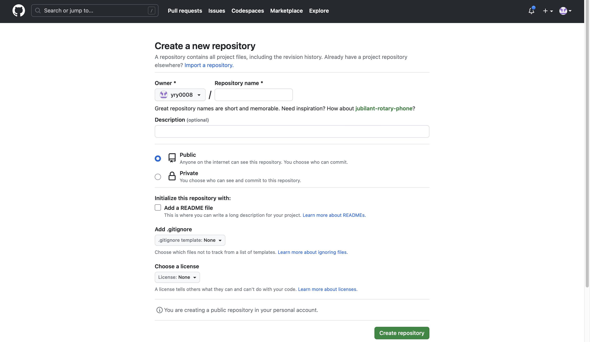
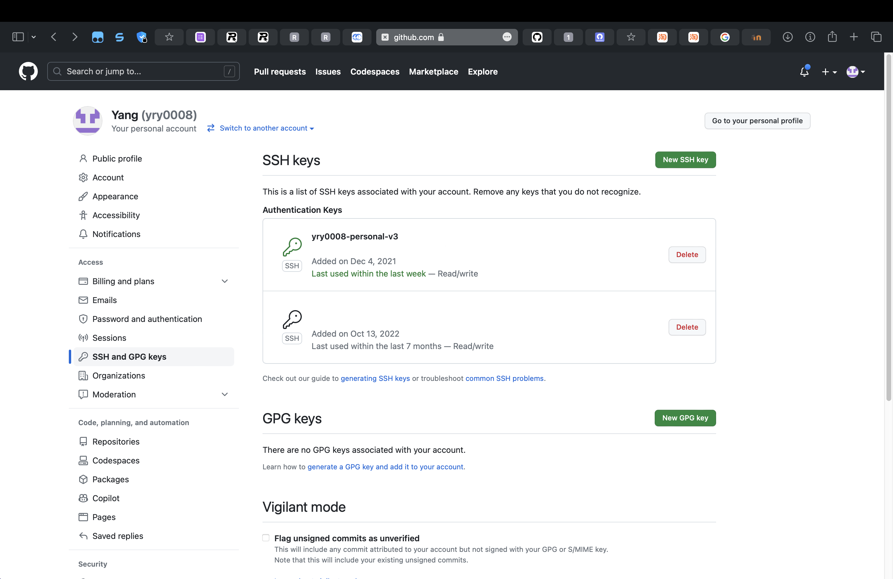

# 如何使用 Git

[English](README.md) | [中文](README_zh.md)

## 1. Git 简介

### 1.1 什么是 Git

Git 是一个分布式版本控制系统，用于管理软件开发的源代码。 它专为对非常大型项目的高效和可靠管理而设计，也适用于小型项目。 它目前是世界上最受欢迎的版本控制系统。

### 1.2 为什么使用 Git

Git 是一个分布式版本控制系统，它与集中式版本控制系统（例如SVN）不同。 它具有以下优势：

1. 分布式开发，无需依靠网络，您可以离线工作。
2. Git 具有完整的分支管理系统，非常方便分支机构管理和合并。
3. Git 具有完整的标记系统，对于版本管理非常方便。
4. Git 具有完整的日志系统，对于项目管理非常方便。
5. Git 具有完整的协作机制，对于团队协作非常方便。

### 1.3 安装Git

#### 1.3.1 Windows

在终端中运行以下命令：

```cmd
winget install Git.Git
```

#### 1.3.2 Linux(Ubuntu)

在终端中运行以下命令：

```bash
sudo apt install git
```

#### 1.3.3 MacOS

通常情况下，Mac 自带 Git。 如果没有，你可以 [安装 brew](https://brew.sh) 之后在终端中运行以下命令：

```bash
brew install git
```

### 1.4 Git 配置

#### 1.4.1 用户信息

在终端中运行以下命令：

```bash
git config --global user.name "Your Name"
git config --global user.email "Your Email"
```

#### 1.4.2 编辑器

在终端中运行以下命令：

```bash
# For VSCode
git config --global core.editor "code --wait"
# For Vim
git config --global core.editor "vim"
```

### 1.5 Git基本操作

#### 1.5.1 创建仓库

在终端中运行以下命令：

```bash
git init
```

#### 1.5.2 添加文件

在终端中运行以下命令：

```bash

# Add all files
git add .

# Add a specific file
git add <file name>
```

#### 1.5.3 提交

在终端中运行以下命令：

```bash
git commit -m "Commit Message"
```

#### 1.5.4 监测状态

在终端中运行以下命令：

```bash
git status
```

#### 1.5.5 查看提交历史

在终端中运行以下命令：

```bash
git log
```

#### 1.5.6 查看修改

在终端中运行以下命令：

```bash
git diff
```

#### 1.5.7 查看操作历史

在终端中运行以下命令：

```bash
git reflog
```

#### 1.5.8 分支

在终端中运行以下命令：

```bash
# Create a branch
git branch <branch name>

# Switch to a branch
git checkout <branch name>

# Create a branch and switch to it

git checkout -b <branch name>

# Delete a branch
git branch -d <branch name>
```

#### 1.5.8 重置仓库到某个提交/分支

在终端中运行以下命令：

```bash
# Reset to the last commit
git reset --hard HEAD^

# Reset to the specific commit
git reset --hard <commit id|branch name>

# Reset to the specific commit and keep the changes
git reset --soft <commit id|branch name>

# Reset to the specific commit and keep the changes in the staging area
git reset --mixed <commit id|branch name>

```

#### 1.5.9 合并分支

在终端中运行以下命令：

```bash
# Merge a branch to the current branch
git merge <branch name>
# If there is a conflict, you need to manually modify the conflict file and then add and commit it.
```

#### 1.5.10 添加远程仓库

在终端中运行以下命令：

```bash
git remote add <remote name> <remote address>
```

#### 1.5.11 删除远程仓库

在终端中运行以下命令：

```bash
git remote rm <remote name>
```

## 2. GitHub

### 2.1 什么是 GitHub

GitHub 是 GIT 存储库托管服务，它提供了基于 Web 的图形接口和桌面和移动集成。 它还为每个项目提供访问控制和几个协作功能，例如错误跟踪，功能请求，任务管理和 Wiki。

### 2.2 为什么使用 GitHub

GitHub 是 GIT 存储库托管服务，它与集中式版本控制系统（例如 SVN）不同。 它具有以下优势：

1. GitHub 是一个基于 Web 的图形接口，对于项目管理非常方便。
2. GitHub 具有完整的协作机制，这对于团队协作非常方便。
3. GitHub 具有一个完整的问题系统，对于错误跟踪和功能请求非常方便。
4. GitHub 具有完整的 Wiki 系统，非常方便文档。
5. GitHub 具有完整的拉请求系统，非常方便代码审核。
6. GitHub 具有完整的动作系统，对于 CI/CD 非常方便。

### 2.3 创建仓库

1. 单击 GitHub 主页右上角的 `+` 按钮，然后在下拉菜单中选择 `New Repository`。

   

2. 输入仓库名字然后点击 `Create repository`.

   

### 2.4 设置SSH Key

1. 在终端中运行以下命令：

    ```bash
    ssh-keygen -t ed25519
    ```

2. 点击回车键三次，会设置一个空密码并且使用默认路径。

3. 在终端中运行以下命令：

    ```bash
    cat ~/.ssh/id_ed25519.pub
    ```

    如果正在使用Windows, 在终端中运行以下命令：

    ```cmd
    type %USERPROFILE%\.ssh\id_ed25519.pub
    ```

4. 复制输出的内容。
5. 点击 GitHub 主页右上角的头像，然后点击 `Settings`。
6. 点击左侧的 `SSH and GPG keys`。
7. 点击右上角的 `New SSH key`。
8. 输入标题和SSH密钥。
9. 点击 `Add SSH key`。
10. 然后你就可以看到你刚刚添加的SSH密钥了。

    

### 2.4 克隆仓库

1. 点击 GitHub 仓库页面右上角的 `Code` 按钮，然后点击 `SSH` 按钮。
2. 在终端中运行以下命令：

    ```bash
    git clone <repository address>
    ```

    >注意: 如果你正在克隆一个私有仓库，请使用 SSH 地址。如果你正在克隆一个公共仓库，则可以使用 HTTPS 地址。

### 2.5 推送

> 注意: 在推送之前，你需要添加远程仓库地址，并且设置好 SSH Key。

在终端中运行以下命令：

```bash
git push <remote name> <branch name>
```

### 2.6 拉取

> 注意: 在拉取之前，你需要添加远程仓库地址，并且设置好 SSH Key。

在终端中运行以下命令：

```bash
git pull <remote name> <branch name>
```

## 3. Pull Request

### 3.1 什么是 Pull Request

Pull Request 是 GitHub 提供的功能（以及许多其他 Git 远程提供商），该功能用于将代码提交给存储库。 它通常用于合并和代码审核。

### 3.2 How to use Pull Request

1. 单击存储库页面右上角的 `Pull requests` 按钮，然后在下拉菜单中单击 `New pull request`。
2. 选择需要合并的分支。
3. 点击 `Create pull request`.
4. 输入标题和描述。
5. 点击 `Create pull request`.
6. 你可以发现你的 pull request 已经创建了。
7. 如果你想合并这个 pull request，点击 `Merge pull request` 然后点击 `Confirm merge`.

### 3.3 If there are conflicts in PR

1. 如果你的PR有冲突，你需要手动在本地修改文件以解决冲突（GitHub 会提示你哪些文件有冲突并且会告诉你如何解决）。然后你需要提交这些修改。
