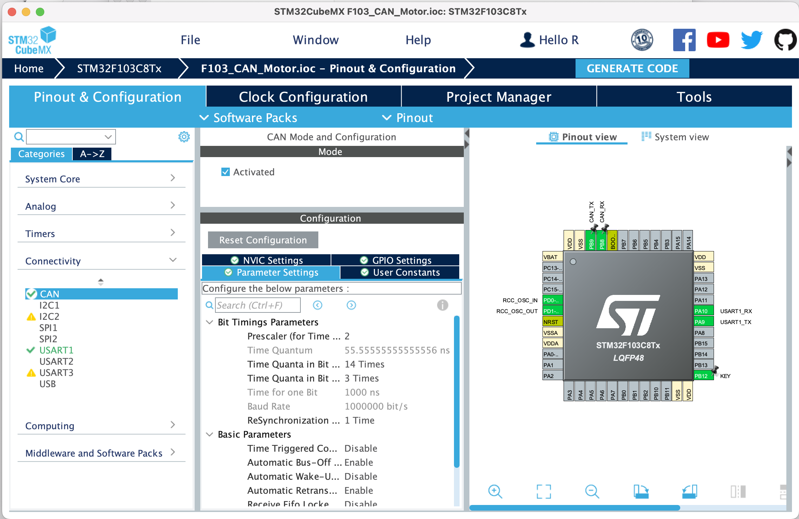

# CAN protocol and motor control

[English](README.md) | [中文](README_zh.md)

## CAN protocol

CAN（Controller Area Network）is a serial communication protocol. It was originally developed by BOSCH in Germany for communication inside automobiles. CAN protocol has the characteristics of high reliability, high real-time performance and high bandwidth utilization, so it has been widely used in industrial control, aerospace and other fields.

### The basic concepts of CAN protocol

CAN protocol has two basic concepts: frame and message.

Frame is the basic data unit in CAN protocol, which contains all the information of the message. Message is the user data, which contains the data that the user wants to transmit.

### CAN protocol basic structure

CAN protocol data frame consists of the following parts:

- SOF (Start of Frame): used to identify the beginning of the frame.

- Type: used to identify the type of frame, including data frame and remote frame.

- ID: used to identify the ID of the message.

- Control: used to identify the control information of the frame, including data length, data direction, data format, etc.

- Data: used to store user data.

- CRC (Cyclic Redundancy Check): used to check the correctness of data.

- EOF (End of Frame): used to identify the end of the frame.

### CAN Details

[Video(Chinese)](https://www.bilibili.com/video/BV1Dq4y1J7WA/?spm_id_from=333.337.search-card.all.click&vd_source=12f331bedce3ff2e9fdf30aaa1f157d3)

## Control motor with CAN protocol

First, we need to understand the CAN protocol of RoboMaster's commonly used motors.

[C620 Manual](https://rm-static.djicdn.com/tem/17348/RoboMaster%20C620无刷电机调速器使用说明（中英日）V1.01.pdf) | [C610 Manual](https://rm-static.djicdn.com/tem/RM%20C610无刷电机调速器使用说明%20发布版.pdf)

### How to control the motor?

It is written in the manual that the ESC will store a set of IDs as the ESC ID. The development board needs to accept messages with a CAN ID of 0x200 + the ESC ID to return data, and send messages with a CAN ID of 0x200 to control the motor. (When the ESC ID is 1-4).

### CAN with STM32CubeMX 

Before configuring CAN, we assume that you have configured the clock environment and configured the input button, and named the button label KEY. Please refer to [this document](../6.Key_Input/README.md) and [this document](../2.New_Empty_Project/README.md) for specific tutorials.

First we need to configure CAN in STM32CubeMX.

Activate CAN in CubeMX and due to our board design, interfaces for CAN need to be bound to PB8 and PB9.

Set the frequency division coefficient so that the baud rate is 1Mbps. (This step can be filled in according to the picture below)

Turn on the automatic retransmission and automatic offline functions of CAN. (This step can be filled in according to the picture below)

Note: When setting CAN, an error may be reported. Please first increase the prescaler according to the prompt, and then decrease the prescaler.



Turn on UART1 and set the baud rate to 115200.


Turn on the CAN RX FIFO 0 interrupt.


Turn on Project Manager, open Advanced Settings, and open CAN's Register Callbacks to start CAN's callback function.


### Code

Refer [This file](../../sample/1.16.F103_CAN_Motor/F103_CAN_Motor/Core/Src/main.c)

Main Program

```c
HAL_Delay(1000);
char print_buffer[100];
while (1)
{
    uint32_t can_id = 0x200;
    CAN_TxHeaderTypeDef header = {
            .StdId = can_id,
            .ExtId = 0x0,  // don't care since we use standard id mode
            .IDE = CAN_ID_STD, //Basic mode
            .RTR = CAN_RTR_DATA, //Data transmission mode
            .DLC = 8, //Data length
            .TransmitGlobalTime = DISABLE, 
    };
    uint8_t can_data[8] = {0x10, 0x02, 0x00,0x00,0x00,0x00,0x00,0x00};
    // 检查按钮状态
    if (HAL_GPIO_ReadPin(KEY_GPIO_Port, KEY_Pin) == GPIO_PIN_RESET) {
        can_data[0]=0x08;
        can_data[1]=0x02;
    }
    else{
        can_data[0]=0x00;
        can_data[1]=0x00;
    }
    // 参考RM电机的说明书
    uint32_t mailbox;
    // 邮箱是一个变量，用于存储发送的消息的ID
    // 可以用于检查消息是否发送成功
    HAL_CAN_AddTxMessage(&hcan, &header, (uint8_t*)can_data, &mailbox);
    // 发送消息
    while(HAL_CAN_IsTxMessagePending(&hcan, mailbox));
    // 检测消息是否发送成功
    sniprintf(print_buffer,99,"ECD: %d RPM: %d CUR: %d TEMP:%d \r\n",ecd,speed_rpm,given_current,temperate);
    HAL_UART_Transmit(&huart1,print_buffer,strlen(print_buffer),50);
    HAL_Delay(20);


/* USER CODE END WHILE */

/* USER CODE BEGIN 3 */
}
```

初始化 CAN

```c
CAN_FilterTypeDef filter;
filter.FilterIdHigh = 0x0000;
filter.FilterIdLow = 0x0000;
filter.FilterMaskIdHigh = 0x0000;
filter.FilterMaskIdLow = 0x0000;
filter.FilterFIFOAssignment = CAN_FILTER_FIFO0;
filter.FilterMode = CAN_FILTERMODE_IDMASK;
filter.FilterScale = CAN_FILTERSCALE_32BIT;
filter.FilterActivation = ENABLE;
filter.SlaveStartFilterBank = 14;  // CAN1 and CAN2 split all 28 filters
filter.FilterBank = 0;  // Master CAN get filter 0-13
// Set the filter
HAL_CAN_ConfigFilter(&hcan,&filter);
HAL_CAN_RegisterCallback(&hcan, HAL_CAN_RX_FIFO0_MSG_PENDING_CB_ID,RxFIFO0MessagePendingCallback);
// Register callback function
HAL_CAN_ActivateNotification(&hcan, CAN_IT_RX_FIFO0_MSG_PENDING);
// Set callback notification
HAL_CAN_Start(&hcan);
// Start CAN
```

Callback function

```c
/* USER CODE BEGIN 0 */
// this function is for can callback
uint16_t ecd;
uint16_t last_ecd;
uint16_t speed_rpm;
uint16_t given_current;
uint16_t temperate;
void RxFIFO0MessagePendingCallback(CAN_HandleTypeDef *hcan)
{
    CAN_RxHeaderTypeDef rx_header;
    uint8_t rx_data[8];

    HAL_CAN_GetRxMessage(hcan, CAN_RX_FIFO0, &rx_header, rx_data);
    // Process data according to the manual
    switch (rx_header.StdId)
    {
        case 0x201:
        {
            last_ecd = ecd;
            ecd = (uint16_t)rx_data[0]<<8|rx_data[1];
            speed_rpm = (uint16_t)rx_data[2]<<8|rx_data[3];
            given_current = (uint16_t)rx_data[4]<<8|rx_data[5];
            temperate = (uint16_t)rx_data[6];
            // Process data
            break;
        }
        default:
        {
            break;
        }
    }
}
/* USER CODE END 0 */
```


Finish the program and flash it into the board.

Set the ID of the motor to 1, and then press the button, the motor will rotate.

Connect UART1 to the computer and open the serial assistant to see the data of the motor.