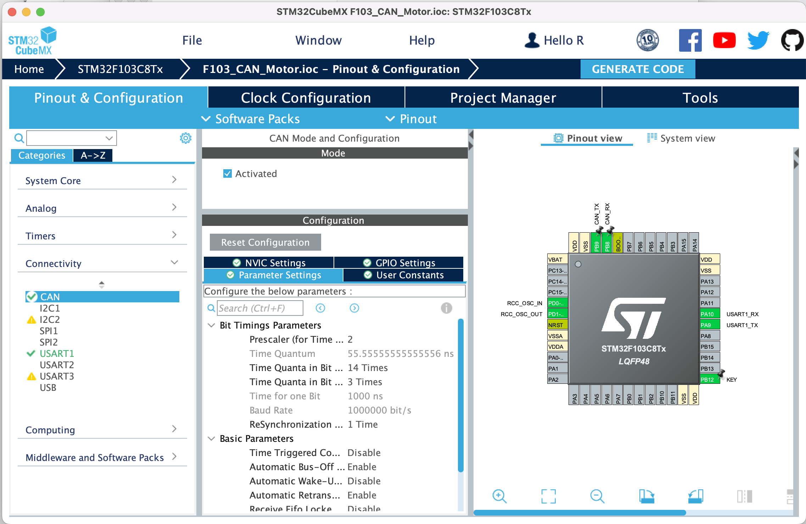
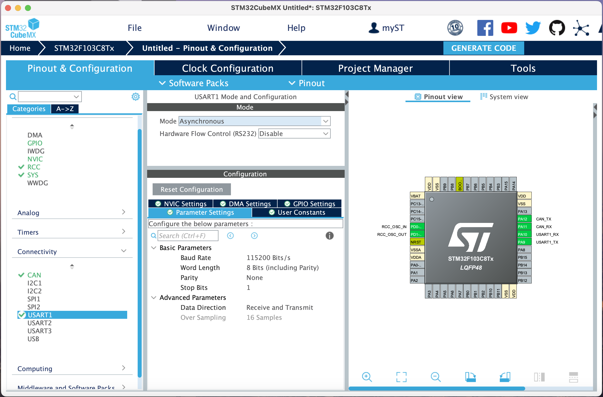
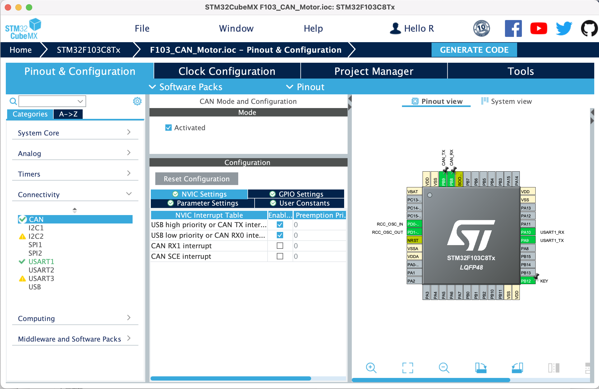
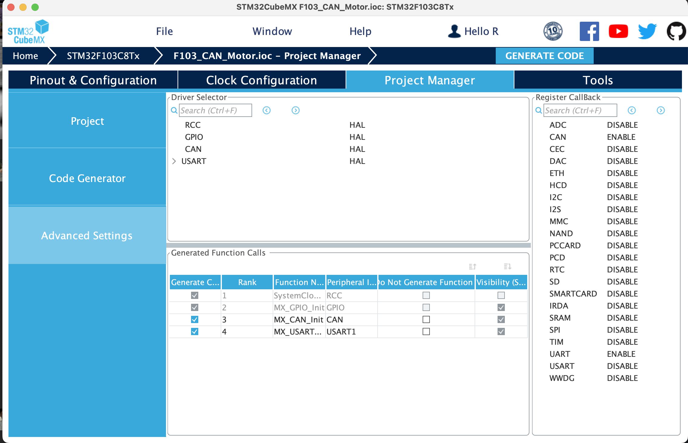

# CAN 协议与 RoboMaster 的常用电机

[English](README.md) | [中文](README_zh.md)

## CAN 协议

CAN（Controller Area Network）是一种串行通信协议，它最初由德国 BOSCH 公司开发，用于汽车内部的通信。CAN 协议具有高可靠性、高实时性、高带宽利用率等特点，因此在工业控制、航空航天等领域得到了广泛的应用。

### CAN 协议的基本概念

CAN 协议中有两个基本概念：帧（Frame）和报文（Message）。

帧是 CAN 协议中的基本数据单元，它包含了报文的所有信息。报文是用户数据，它包含了用户想要传输的数据。

CAN 协议中有两种帧：数据帧（Data Frame）和远程帧（Remote Frame）。数据帧用于传输用户数据，远程帧用于请求用户数据。

### CAN 协议的基本结构

CAN 协议中的数据帧由以下几个部分组成：

- 帧起始符（SOF，Start of Frame）：用于标识帧的开始。

- 帧类型（Type）：用于标识帧的类型，包括数据帧和远程帧。

- 标识符（ID）：用于标识报文的 ID。

- 控制域（Control）：用于标识帧的控制信息，包括数据长度、数据方向、数据格式等。

- 数据域（Data）：用于存储用户数据。

- CRC（Cyclic Redundancy Check）：用于校验数据的正确性。

- 帧结束符（EOF，End of Frame）：用于标识帧的结束。

### CAN 详细介绍

[华工教学视频](https://www.bilibili.com/video/BV1Dq4y1J7WA/?spm_id_from=333.337.search-card.all.click&vd_source=12f331bedce3ff2e9fdf30aaa1f157d3)
[中科大教学视频](https://www.bilibili.com/video/BV1HY411D7Ar/?spm_id_from=333.337.search-card.all.click)

## 使用 CAN 协议控制电机

首先我们需要了解 RoboMaster 常用电机的 CAN 协议。

[M3508的电调C620的说明书](https://www.robomaster.com/zh-CN/products/components/general/M3508) | [M2006的电调C610的说明书](https://www.robomaster.com/zh-CN/products/components/general/M2006)

### 如何控制电机？

说明书内有写，电调会储存一组 id 作为电调的 ID，开发板需要接受 CAN 的ID为 0x200 + 电调 ID 的报文能够回传数据，发送 CAN 的 ID 为 0x200 报文能够控制电机（当电调ID为1-4的时候）。

### STM32CubeMX 配置 CAN

在配置 CAN 之前，我们假定您已经配置了时钟环境，并且配置了输入按钮，将按钮标签命名为 KEY。具体教程请参考[此文档](../6.Key_Input/README_zh.md)和[此文档](../2.New_Empty_Project/README_zh.md)。

首先我们需要在 STM32CubeMX 中配置 CAN。

在 CubeMX 中激活 CAN，并且由于我们的电路板设计，需要将 CAN 的接口绑定至 PB8 和 PB9。

设置分频系数，使得波特率为 1Mbps。（此步按照下图填写即可）

打开 CAN 的自动重传与自动离线功能。（此步按照下图填写即可）

注意：在设置CAN的时候可能会报错，请先按照提示调高分频系数，再调低分频系数。



打开 UART1 设置波特率为 115200。



打开 CAN 的 RX FIFO 0 中断。



打开 Project Manager，打开 Advanced Settings，打开 CAN 的 Register Callbacks 以启动 CAN 的回调函数。



### 代码配置

参见[此文件](../../sample/1.16.F103_CAN_Motor/F103_CAN_Motor/Core/Src/main.c)

主程序

```c
HAL_Delay(1000);
char print_buffer[100];
while (1)
{
    uint32_t can_id = 0x200;
    CAN_TxHeaderTypeDef header = {
            .StdId = can_id,
            .ExtId = 0x0,  // don't care since we use standard id mode
            .IDE = CAN_ID_STD, //普通模式
            .RTR = CAN_RTR_DATA, //数据传输模式
            .DLC = 8, //数据长度
            .TransmitGlobalTime = DISABLE, 
    };
    uint8_t can_data[8] = {0x10, 0x02, 0x00,0x00,0x00,0x00,0x00,0x00};
    // 检查按钮状态
    if (HAL_GPIO_ReadPin(KEY_GPIO_Port, KEY_Pin) == GPIO_PIN_RESET) {
        can_data[0]=0x08;
        can_data[1]=0x02;
    }
    else{
        can_data[0]=0x00;
        can_data[1]=0x00;
    }
    // 参考RM电机的说明书
    uint32_t mailbox;
    // 邮箱是一个变量，用于存储发送的消息的ID
    // 可以用于检查消息是否发送成功
    HAL_CAN_AddTxMessage(&hcan, &header, (uint8_t*)can_data, &mailbox);
    // 发送消息
    while(HAL_CAN_IsTxMessagePending(&hcan, mailbox));
    // 检测消息是否发送成功
    sniprintf(print_buffer,99,"ECD: %d RPM: %d CUR: %d TEMP:%d \r\n",ecd,speed_rpm,given_current,temperate);
    HAL_UART_Transmit(&huart1,print_buffer,strlen(print_buffer),50);
    HAL_Delay(20);


/* USER CODE END WHILE */

/* USER CODE BEGIN 3 */
}
```

初始化 CAN

```c
CAN_FilterTypeDef filter;
filter.FilterIdHigh = 0x0000;
filter.FilterIdLow = 0x0000;
filter.FilterMaskIdHigh = 0x0000;
filter.FilterMaskIdLow = 0x0000;
filter.FilterFIFOAssignment = CAN_FILTER_FIFO0;
filter.FilterMode = CAN_FILTERMODE_IDMASK;
filter.FilterScale = CAN_FILTERSCALE_32BIT;
filter.FilterActivation = ENABLE;
filter.SlaveStartFilterBank = 14;  // CAN1 and CAN2 split all 28 filters
filter.FilterBank = 0;  // Master CAN get filter 0-13
//设置过滤器
HAL_CAN_ConfigFilter(&hcan,&filter);
HAL_CAN_RegisterCallback(&hcan, HAL_CAN_RX_FIFO0_MSG_PENDING_CB_ID,RxFIFO0MessagePendingCallback);
//注册回调函数
HAL_CAN_ActivateNotification(&hcan, CAN_IT_RX_FIFO0_MSG_PENDING);
// 设置回调通知
HAL_CAN_Start(&hcan);
//启动can
```

回调函数
```c
/* USER CODE BEGIN 0 */
// this function is for can callback
uint16_t ecd;
uint16_t last_ecd;
uint16_t speed_rpm;
uint16_t given_current;
uint16_t temperate;
void RxFIFO0MessagePendingCallback(CAN_HandleTypeDef *hcan)
{
    CAN_RxHeaderTypeDef rx_header;
    uint8_t rx_data[8];

    HAL_CAN_GetRxMessage(hcan, CAN_RX_FIFO0, &rx_header, rx_data);
    //按照说明书解析can的id和数据
    switch (rx_header.StdId)
    {
        case 0x201:
        {
            last_ecd = ecd;
            ecd = (uint16_t)rx_data[0]<<8|rx_data[1];
            speed_rpm = (uint16_t)rx_data[2]<<8|rx_data[3];
            given_current = (uint16_t)rx_data[4]<<8|rx_data[5];
            temperate = (uint16_t)rx_data[6];
            //解析数据
            break;
        }
        default:
        {
            break;
        }
    }
}
/* USER CODE END 0 */
```

由于使用了snprintf与strlen函数，请务必在文件开头引入string库和stdio库。

```c
#include <string.h>
#include <stdio.h>
```

程序写完并且烧录之后
将电机的 ID 设置为1，
然后按下按键，电机就会转动。

将 UART1 连接至电脑，打开串口助手，就可以看到电机的数据。

