# New Empty Project

[English](README.md) | [中文](README_zh.md)

## 1. The board we use

We have four type of boards now. The Nano_F103 board usually used for education, The other models of boards would be installed to the robots.

### 1.1. Nano_F103

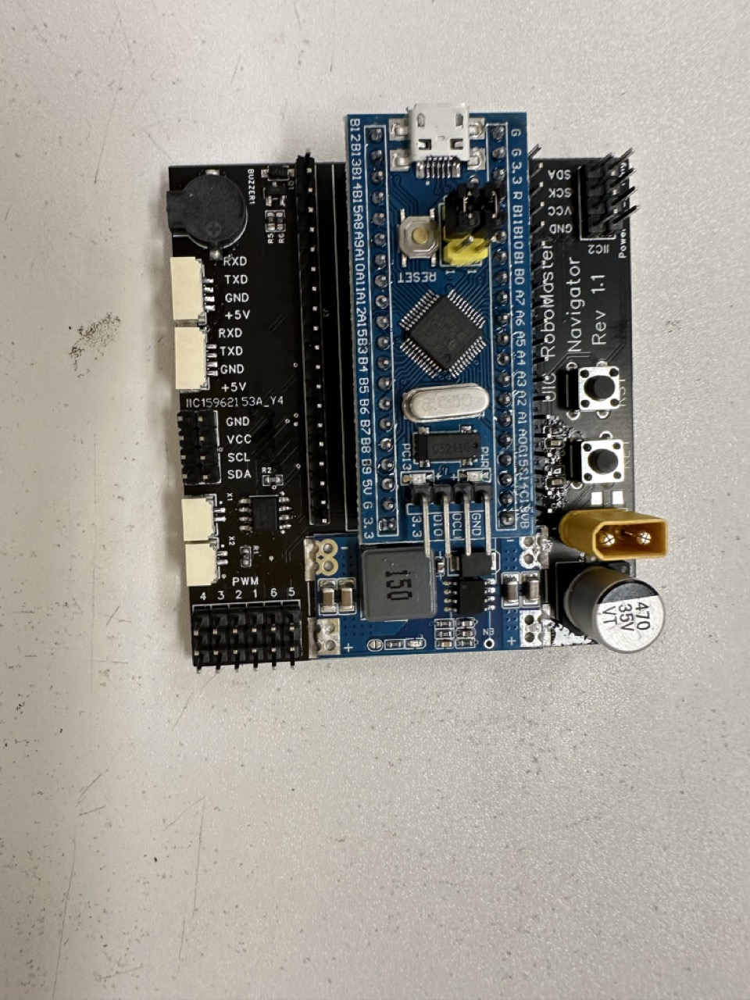

[Circuit Diagram](attachments/STM32F103C8T6%E6%A0%B8%E5%BF%83%E6%9D%BF%E5%8E%9F%E7%90%86%E5%9B%BE.pdf)
[Circuit Diagram For Extend Board(Rev 1.1)](attachments/SCH_Schematic1_2023-06-02.pdf)

MCU: STM32F103C8T6 / STM32F103CBT6 [DataSheet](https://www.st.com/resource/en/datasheet/stm32f103c8.pdf)

RAM: 20KB

Flash: 64KB / 128KB

Frequency: 72MHz

Power:

    Rev 1.0: 5V (USB / XH2.54 2P)
    Rev 1.1: 5V (USB) / 7-30V (XT30, Can Directly Connect to DJI TB47/TB48 Battery)

Communication:

    All: USB(Currently disabled on BSP) / UART(4Pin GH1.25) / I2C / SPI(Should manually use cable) / CAN(2Pin GH1.25)

Fimware Update: SWD(4Pin 2.54)

    Note: Please connect the SWD cable correctly. Otherwise, the board would be damaged.

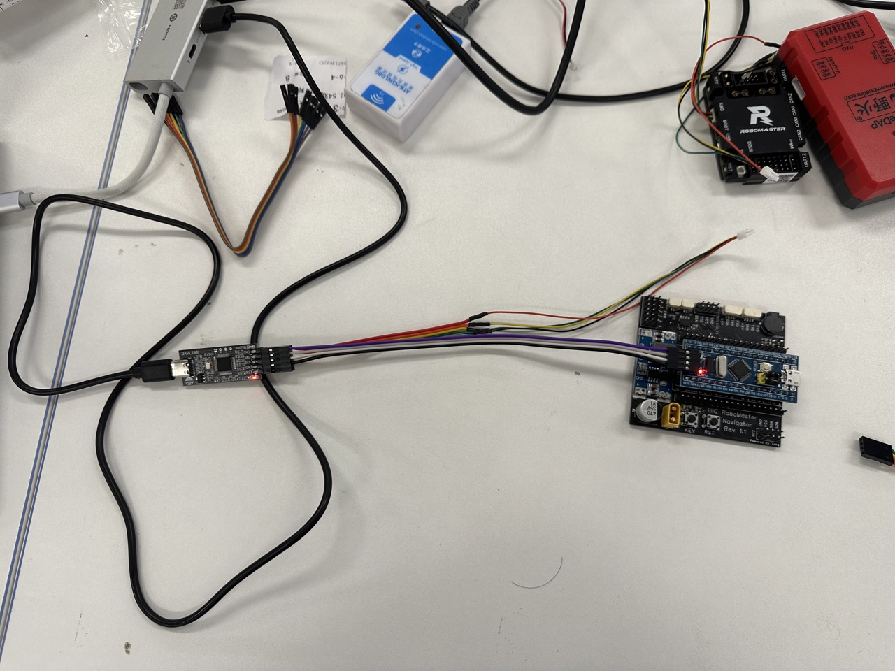

### 1.2. DJI_Board_TypeC

[Official Site](https://www.robomaster.com/zh-CN/products/components/general/development-board-type-c/info)

[Circuit Diagram](attachments/RoBoMaster%20%E5%BC%80%E5%8F%91%E6%9D%BF%20C%20%E5%9E%8B%E5%8E%9F%E7%90%86%E5%9B%BE.pdf)

MCU: STM32F407IGH6 [DataSheet](https://www.st.com/resource/en/datasheet/stm32f407ig.pdf)

RAM: 192KB(128KB + 64KB CCM)

Flash: 1MB

Frequency: 168MHz

Power: 7-28V (XT30, Can Directly Connect to DJI TB47/TB48 Battery)

Communication:

    USB / UART*2 / I2C / SPI / CAN*2 / D-BUS
    Warning: The UART1 and UART2 interface should refer to the circuit diagram. The hardware UART1 corresponds to the actual UART6, and the hardware UART2 corresponds to the actual UART1.

Internal Sensor:

    > BMI088 (Accelerometer + Gyroscope)
    > IST8310 (Magnetometer)
    > Voltage

Fimware Update: SWD(MX 1.25 4Pin)

### 1.3. DJI_Board_TypeA

[Official Site](https://www.robomaster.com/zh-CN/products/components/general/development-board)

[Circuit Diagram](attachments/RoboMaster%20%E5%BC%80%E5%8F%91%E6%9D%BFA%E5%9E%8B%20%E5%8E%9F%E7%90%86%E5%9B%BE.pdf)

MCU: STM32F427IIH6 [DataSheet](https://www.st.com/resource/en/datasheet/stm32f427ii.pdf)

RAM: 256KB(192KB + 64KB CCM)

Flash: 2MB

Frequency: 180MHz(Currently Run on 168MHz)

Power: 7-28V (XT30, Can Directly Connect to DJI TB47/TB48 Battery)

Communication:

    USB / UART*4 / I2C / SPI / CAN*2 / D-BUS

Internal Sensor:

    MPU6600(Accelerometer + Gyroscope)
    IST8310(Magnetometer)
    Voltage

Fimware Update: SWD(MX 1.25 4Pin)

### 1.4. DM_MC01 Board

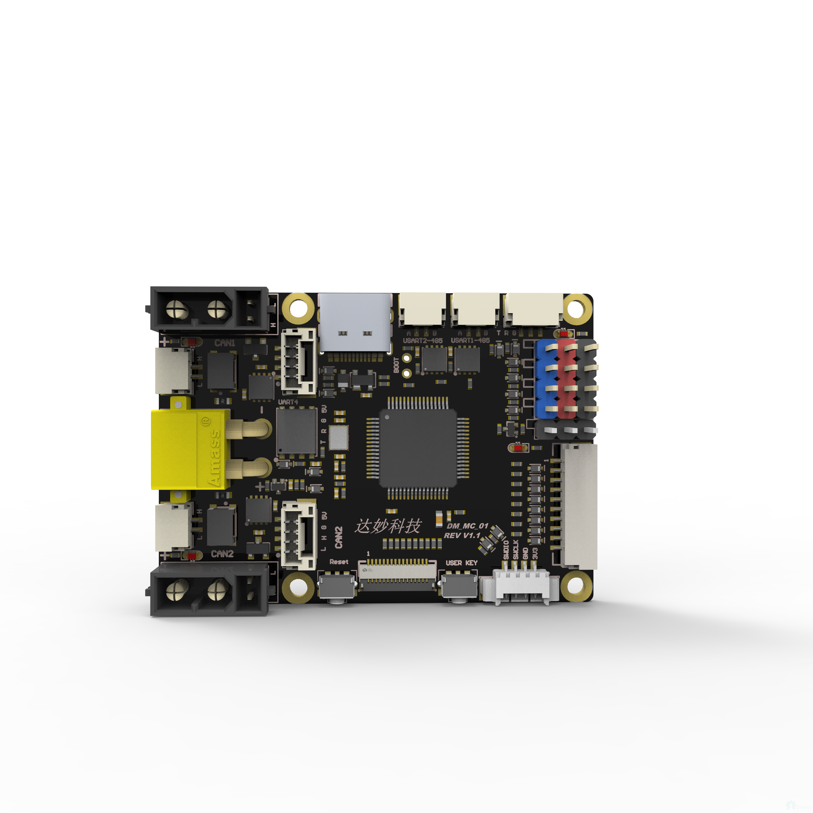

[Circuit Diagram](attachments/MC_Board%E5%8E%9F%E7%90%86%E5%9B%BE.pdf)

MCU: STM32F446RCT6 [DataSheet](https://www.st.com/resource/en/datasheet/stm32f446rc.pdf)

RAM: 128KB

Flash: 256KB

Frequency: 180MHz(Currently Run on 168MHz)

Power: 7-28V (XT30, Can Directly Connect to DJI TB47/TB48 Battery)

Communication:

    USB / UART*2 / RS485*2 / I2C / SPI / CAN*2 / D-BUS

Firmware Update: SWD(MX 1.25 4Pin)

## 2. New Project

### 2.1. Create a new project on STM32CubeMX

Turns on the STM32CubeMX, and click File -> New Project.

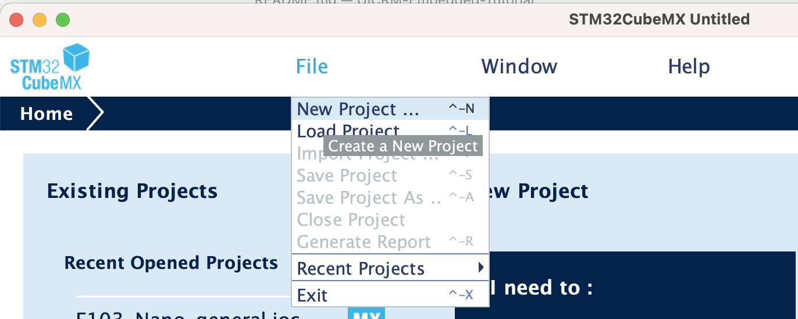

Search the MCU model, and click the MCU model to create a new project.

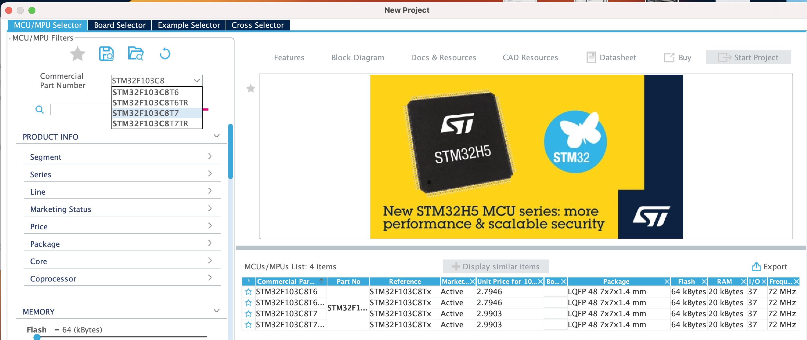

Turn to System Core, and click RCC to set the clock.
We should turns on the High Speed Clock(HSE), and set the clock source to Crystal/Ceramic Resonator.

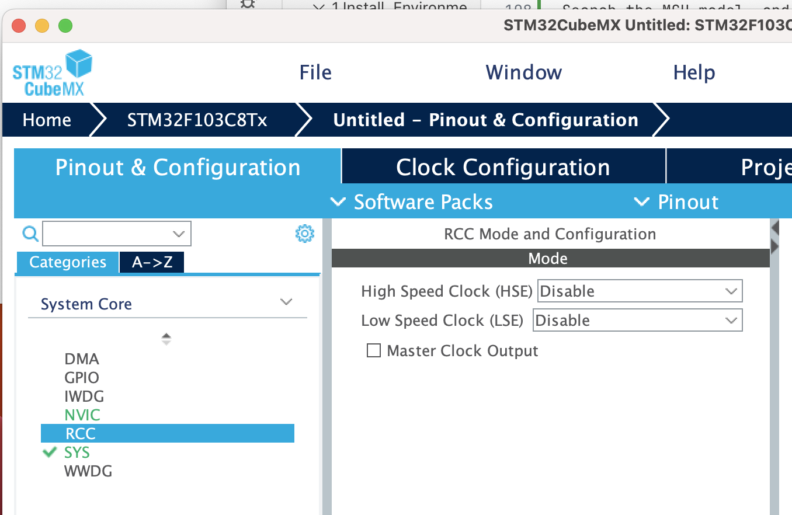

Turn to Clock Configuration, and set the Input Frequency Refer to the Circuit Diagram of the board (For example Nano_F103 Board is 8Mhz). Then set the PLL Source to HSE, and set the System Clock Mux to PLLCLK. Then set the HCLK to the target Frequency (For example Nano_F103 Board is 72Mhz). And it would automatic search the solution.
Also you can set the clock manually for some advanced usage.

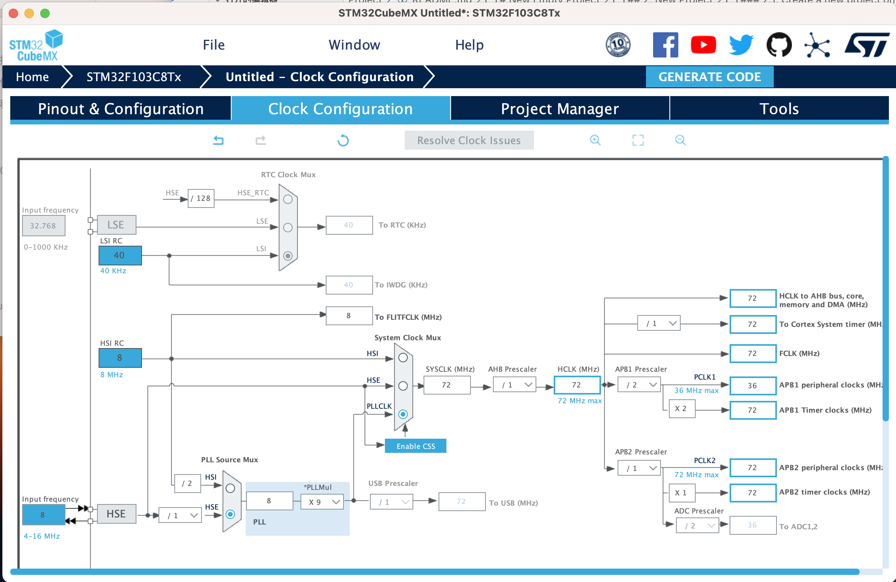

Turn to Pinout & Configuration, and turn to SYS tab. Then set the Debug mode to Serial Wire to enable SWD Debug.

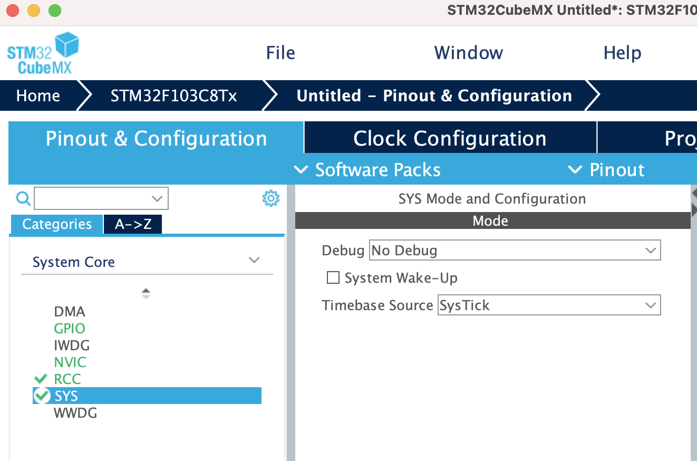

Turn to Project Manager, and set the name and Project Location. Choose the Toolchain/IDE to STM32CubeIDE.

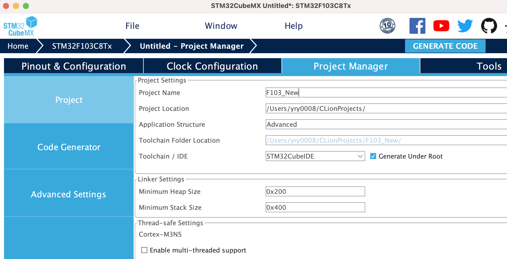

Then turn to Project Manager -> Code Generator, and Turns on Generate peripheral initialization as a pair of '.c/.h' files per peripheral. Then click Generate Code to generate the project.

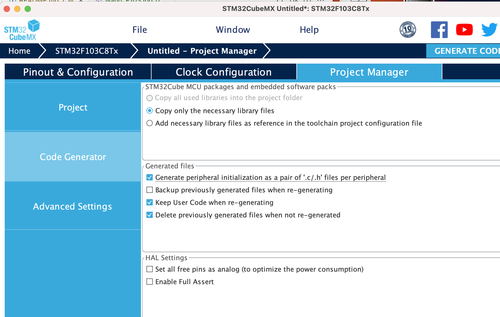

Use Clion to open the project's folder, and you can see the project structure.

    Tips: The openocd configuration file can select anyone, we will replace it in the next step.

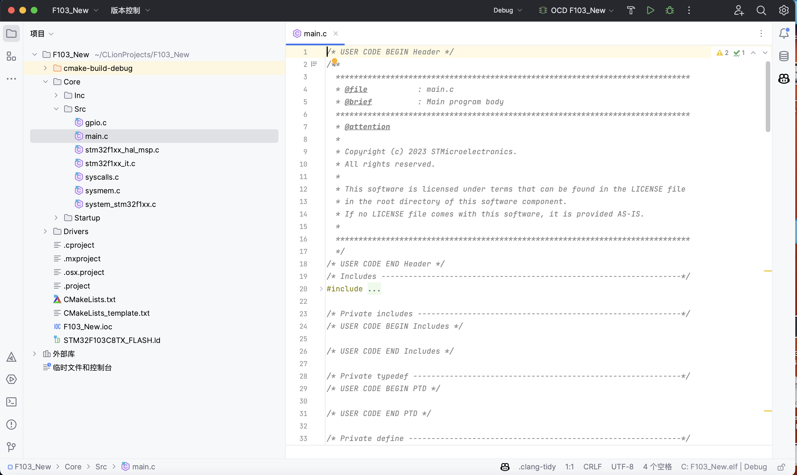

### 2.2. Build and Flash the project

Click the target name, Click the edit configuration button.

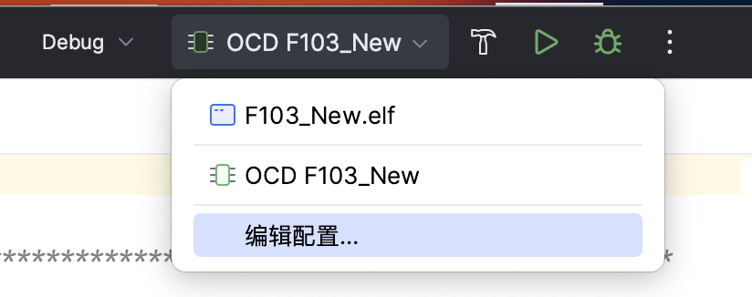

Download the [openocd.cfg](attachments/openocd-stm32f1.cfg) file, and copy it to the project folder. Then set the OpenOCD Configuration File to the openocd.cfg, then click OK.

    Note: The openocd.cfg file is for STM32F1 series. If you use other series, please download the correct file.

[STM32F1](attachments/openocd-stm32f1.cfg)
[STM32F4](attachments/openocd-stm32f4.cfg)

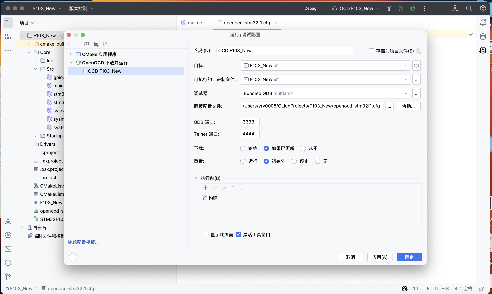

Click the hammer button to build the project.

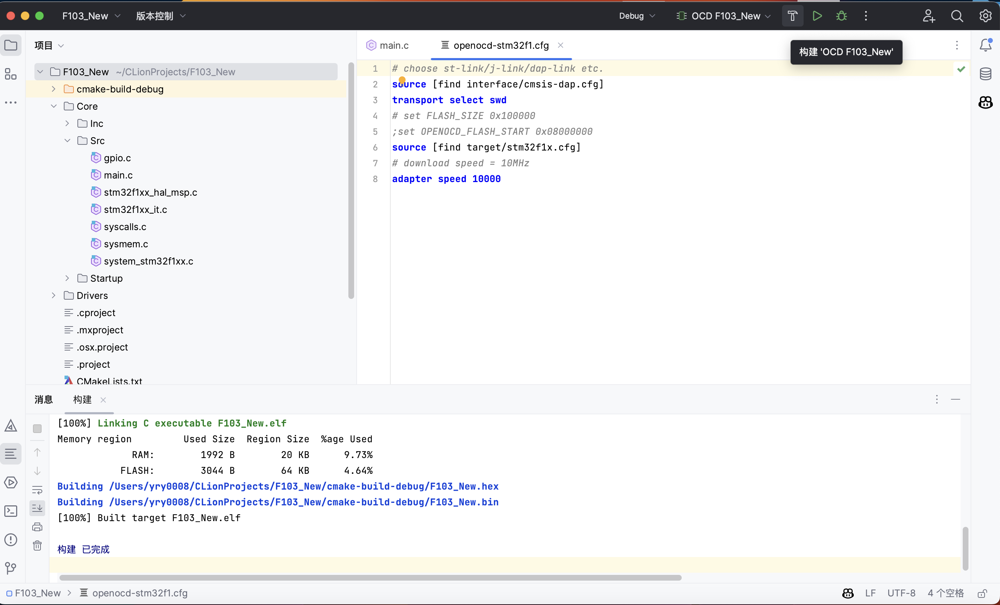

Connect the board to the computer by CMSIS-DAP, and click the Run button to flash the project.

Then the project is flashed successfully.
