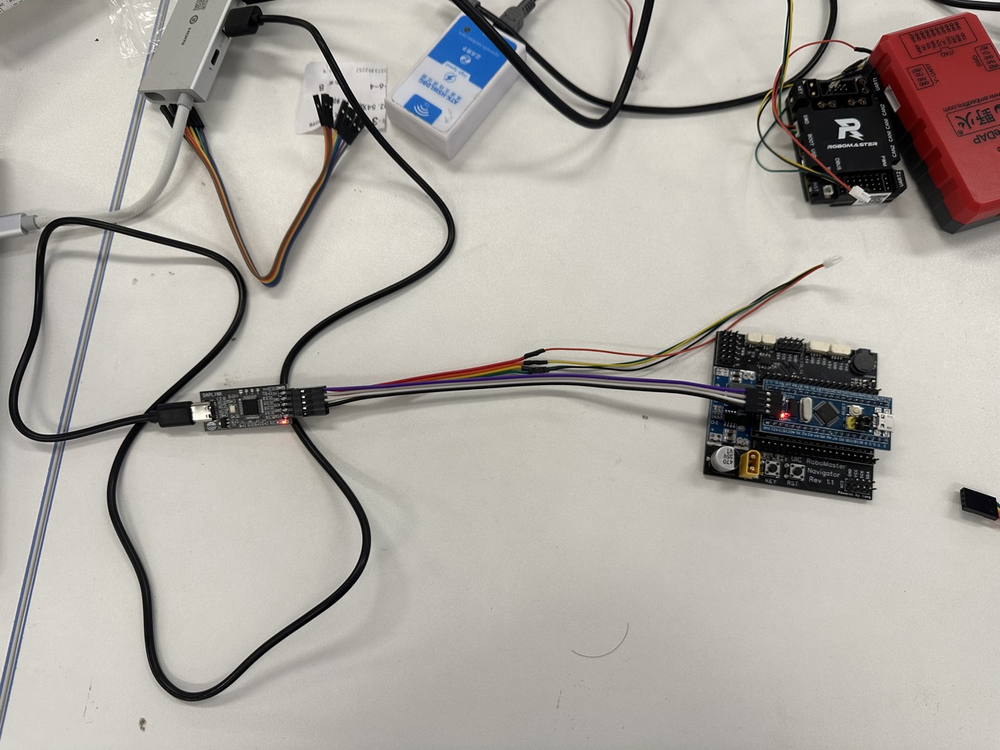
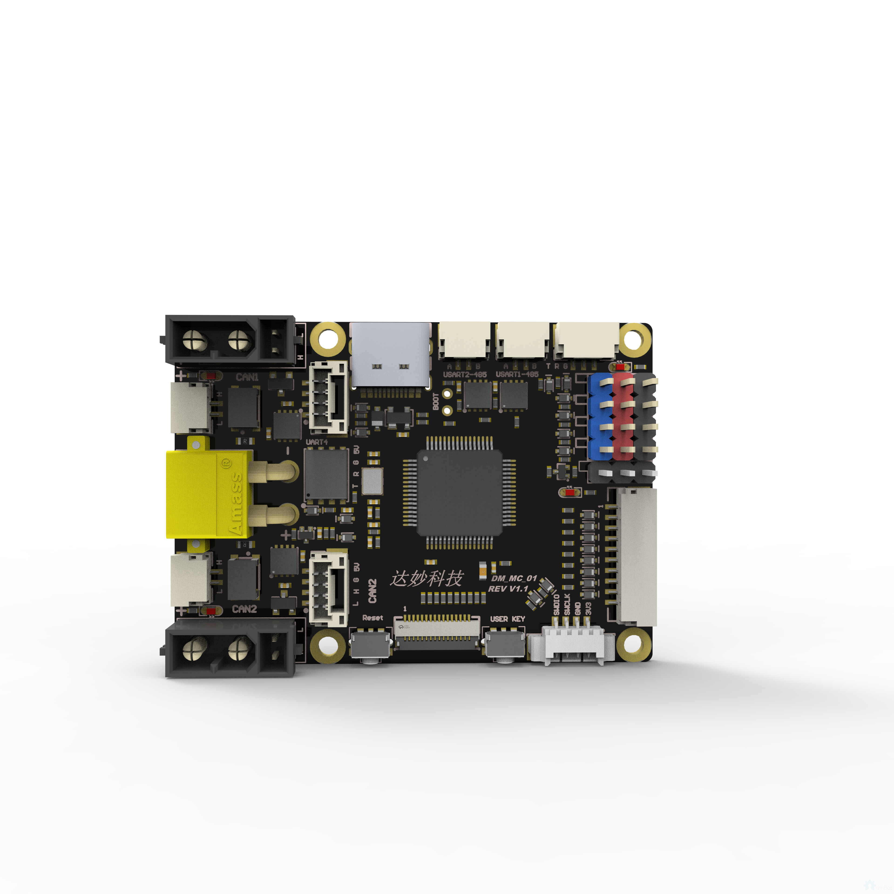
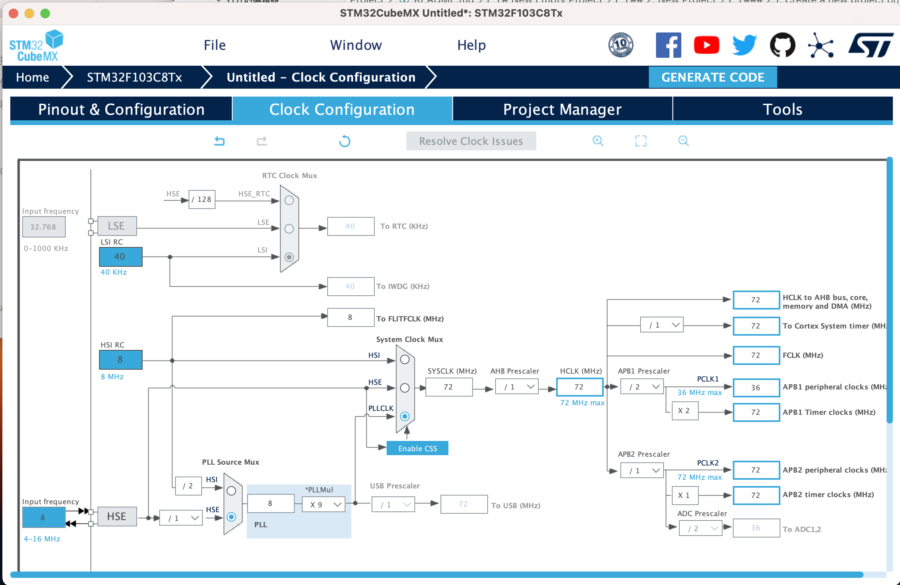
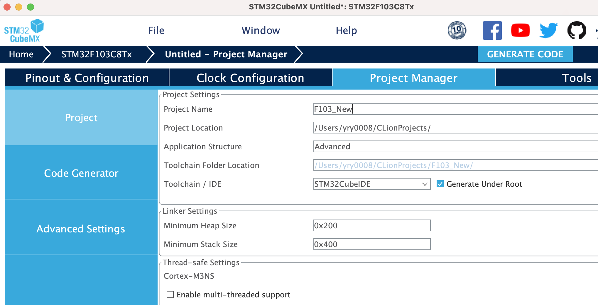
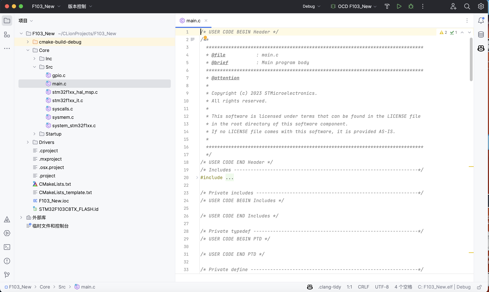
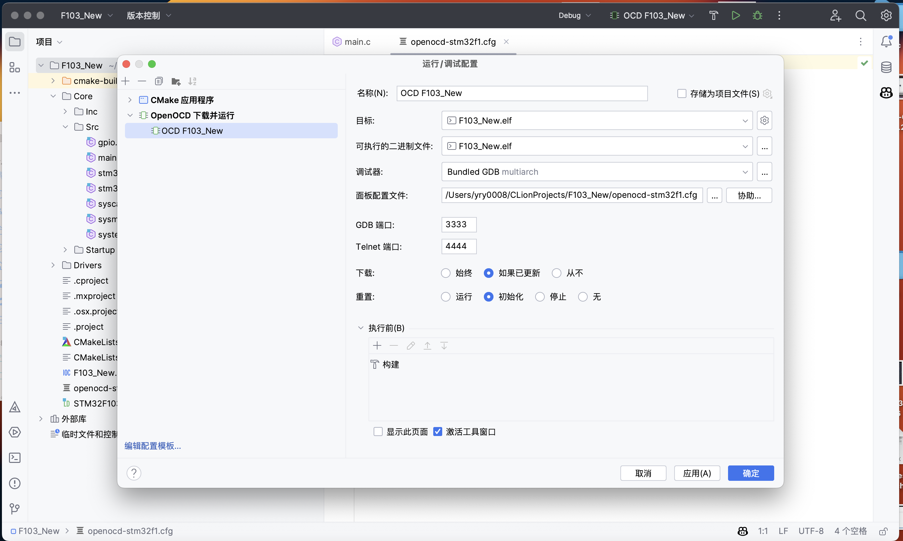
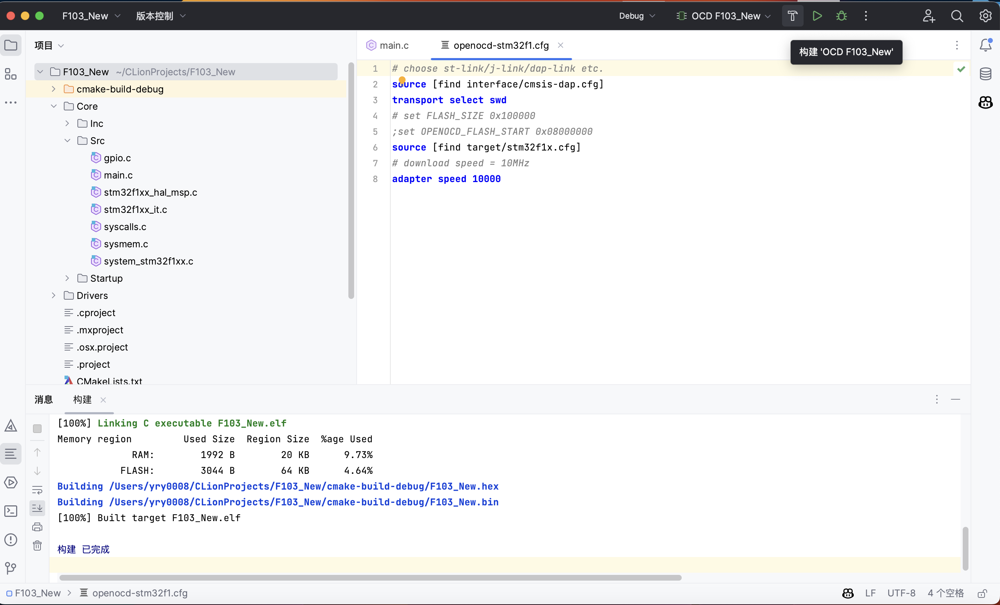

# 新建空白项目

[English](README.md) | [中文](README_zh.md)

## 1. 我们使用的开发板

我们有四种类型的开发板。Nano_F103开发板通常用于培训，其他型号的开发板将安装到机器人上。

### 1.1. Nano_F103

[电路图](attachments/STM32F103C8T6%E6%A0%B8%E5%BF%83%E6%9D%BF%E5%8E%9F%E7%90%86%E5%9B%BE.pdf)
[扩展板电路图(Rev 1.1)](attachments/SCH_Schematic1_2023-06-02.pdf)

MCU: STM32F103C8T6 / STM32F103CBT6 [DataSheet](https://www.st.com/resource/en/datasheet/stm32f103c8.pdf)

RAM: 20KB

Flash: 64KB / 128KB

频率: 72MHz

电源:

    Rev 1.0: 5V (USB / XH2.54 2P)
    Rev 1.1: 5V (USB) / 7-30V (XT30, 可以直接使用DJI TB47/TB48电池)

通讯:

    All: USB(当前在BSP中被禁止使用) / UART(4Pin GH1.25) / I2C / SPI(需要手动外接) / CAN(2Pin GH1.25)

固件升级: SWD(4Pin 2.54)

    Note: 请正确插入SWD线，否则会烧毁开发板。

### 1.2. DJI_Board_TypeC

[官方网站](https://www.robomaster.com/zh-CN/products/components/general/development-board-type-c/info)

[电路图](attachments/RoBoMaster%20%E5%BC%80%E5%8F%91%E6%9D%BF%20C%20%E5%9E%8B%E5%8E%9F%E7%90%86%E5%9B%BE.pdf)

MCU: STM32F407IGH6 [DataSheet](https://www.st.com/resource/en/datasheet/stm32f407ig.pdf)

RAM: 192KB(128KB + 64KB CCM)

Flash: 1MB

频率: 168MHz

电源: 7-28V (XT30, 可以直接使用DJI TB47/TB48电池)

通讯:

    USB / UART*2 / I2C / SPI / CAN*2 / D-BUS
    警告：UART1与UART2的接口请参照电路图，硬件UART1对应实际上的UART6，硬件UART2对应实际上的UART1。

内部传感器:

    > BMI088 (陀螺仪+加速度计)
    > IST8310 (磁力计)
    > 电压

固件升级: SWD(MX 1.25 4Pin)

### 1.3. DJI_Board_TypeA

[官网](https://www.robomaster.com/zh-CN/products/components/general/development-board)

[电路图](attachments/RoboMaster%20%E5%BC%80%E5%8F%91%E6%9D%BFA%E5%9E%8B%20%E5%8E%9F%E7%90%86%E5%9B%BE.pdf)

MCU: STM32F427IIH6 [DataSheet](https://www.st.com/resource/en/datasheet/stm32f427ii.pdf)

RAM: 256KB(192KB + 64KB CCM)

Flash: 2MB

频率: 180MHz(当前使用 168MHz)

电源: 7-28V (XT30, 可以直接使用DJI TB47/TB48电池)

通讯:

    USB / UART*4 / I2C / SPI / CAN*2 / D-BUS

内部传感器:

    > MPU6600(陀螺仪+加速度计)
    > IST8310(磁力计)
    > 电压

固件升级: SWD(MX 1.25 4Pin)

### 1.4. DM_MC01 Board

[电路图](attachments/MC_Board%E5%8E%9F%E7%90%86%E5%9B%BE.pdf)

MCU: STM32F446RCT6 [DataSheet](https://www.st.com/resource/en/datasheet/stm32f446rc.pdf)

RAM: 128KB

Flash: 256KB

频率: 180MHz(当前使用 168MHz)

电源: 7-28V (XT30, Can Directly Connect to DJI TB47/TB48 Battery)

通讯:

    USB / UART*2 / RS485*2 / I2C / SPI / CAN*2 / D-BUS

固件升级: SWD(MX 1.25 4Pin)

## 2. 新建项目

### 2.1. 在 STM32CubeMX 新建项目

打开 STM32CubeMX，点击 File -> New Project.

搜索 MCU 型号，点击 MCU 型号创建新项目。

转到 System Core，点击 RCC 设置时钟。
我们需要打开 High Speed Clock(HSE)，并设置时钟源为 Crystal/Ceramic Resonator。

转到 Clock Configuration，设置输入时钟频率为 8Mhz(参考电路图，例如 Nano_F103 Board 为 8Mhz)。然后设置 PLL Source 为 HSE，设置 System Clock Mux 为 PLLCLK。然后设置 HCLK 为目标频率(例如 Nano_F103 Board 为 72Mhz)。然后点击 Resolve 进行自动搜索。
同时你也可以手动设置时钟，用于一些高级用法。

转到 Pinout & Configuration，转到 SYS 标签页。然后设置 Debug mode 为 Serial Wire 以启用 SWD 调试。

转到 Project Manager，设置项目名称和项目路径。选择 Toolchain/IDE 为 STM32CubeIDE。

转到 Project Manager -> Code Generator，打开 Generate peripheral initialization as a pair of '.c/.h' files per peripheral。然后点击 Generate Code 生成项目。

使用 Clion 打开项目文件夹，你可以看到项目结构。

    提示：OpenOCD 配置文件可以选择任意一个，我们会在下一步替换它。

### 2.2. 编译和烧录代码

点击当前的目标名字，点击编辑配置按钮。

下载 [openocd.cfg](attachments/openocd-stm32f1.cfg) 文件，然后复制到项目文件夹。然后设置 OpenOCD Configuration File 为 openocd.cfg，然后点击 OK。

    注意：openocd.cfg 文件是针对 STM32F1 系列的。如果你使用其他系列，请下载对应的文件。

[STM32F1](attachments/openocd-stm32f1.cfg)
[STM32F4](attachments/openocd-stm32f4.cfg)

点击🔨锤子按钮编译项目。

使用 CMSIS-DAP 连接开发板到电脑，然后点击绿色的 运行▶️ 按钮烧录项目。

项目会自动运行。
