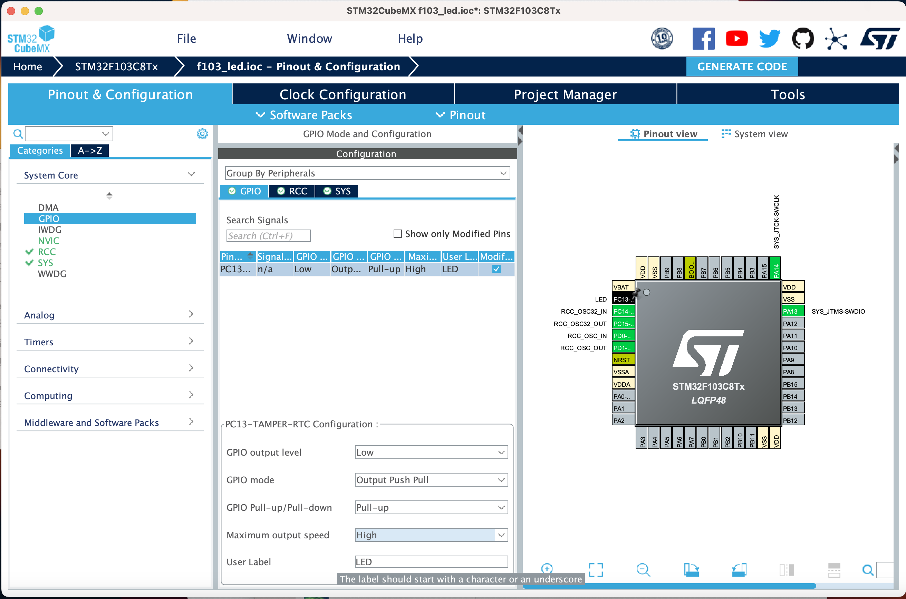

# Light LED

[English](README.md) | [中文](README_zh.md)

## 1. Configure STM32CubeMX

We assume that you have already new a project and update the clock configuration. If not, please refer to [New Empty Project](../2.New_Empty_Project/README.md).

We can see that the LED is connected to the PC13 pin in the [Circuit diagram](../2.New_Empty_Project/attachments/STM32F103C8T6%E6%A0%B8%E5%BF%83%E6%9D%BF%E5%8E%9F%E7%90%86%E5%9B%BE.pdf). So we should set the PC13 pin as GPIO_Output mode.

Click the Pinout & Configuration tab, and then click the PC13 pin. In the Pinout view, select GPIO_Output in the Mode field.


Then click the GPIO tab, and then click the PC13 pin. In the GPIO view, select pull-up in the GPIO Pull-Up/Pull-Down field. This is because the LED is connected to the VCC through a resistor. You can see the [Circuit diagram](../2.New_Empty_Project/attachments/STM32F103C8T6%E6%A0%B8%E5%BF%83%E6%9D%BF%E5%8E%9F%E7%90%86%E5%9B%BE.pdf) for details. If we use the pull-down mode, the LED will always be on.

You can set the maxinum output speed to high speed, but it is not necessary.

Also, you can set a label for the pin. This is useful when you want to use the pin in the code.



Then generate the code.

## 2. Write the code

In the `Core/Src/main.c` file, we can see the `while(1)` loop. We can write the code in the loop.

    ```c
    /* USER CODE BEGIN WHILE */
    while (1)
    {
        /* USER CODE END WHILE */

        /* USER CODE BEGIN 3 */
        HAL_GPIO_WritePin(GPIOC, GPIO_PIN_13, GPIO_PIN_RESET);
        HAL_Delay(1000);
    } 
    ```

The `HAL_GPIO_WritePin` function is used to toggle the pin. The first parameter is the GPIO port, the second parameter is the GPIO pin, and the third parameter is the GPIO pin state. The `GPIO_PIN_RESET` means the pin is low, and the `GPIO_PIN_SET` means the pin is high.
The `HAL_Delay` function is used to delay. The parameter is the delay time in milliseconds.

Then build and flash the project. You can see the LED is light.
