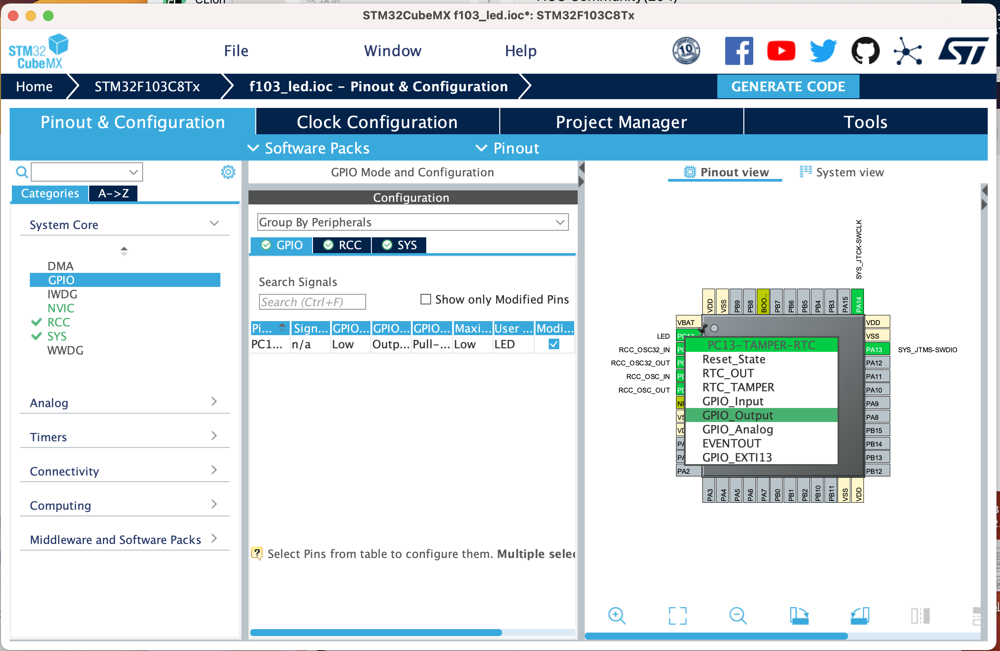

# 点亮一枚LED

[English](README.md) | [中文](README_zh.md)

让我们点亮一枚 LED，这是学习嵌入式系统的第一步。

## 1. 配置 STM32CubeMX

我们假设你已经新建了一个工程并且更新了时钟配置。如果没有，请参考[新建空工程](../2.New_Empty_Project/README_zh.md)。

我们可以在[电路图](../2.New_Empty_Project/attachments/STM32F103C8T6%E6%A0%B8%E5%BF%83%E6%9D%BF%E5%8E%9F%E7%90%86%E5%9B%BE.pdf)中看到 LED 连接到了 PC13 引脚。所以我们需要将 PC13 引脚设置为 GPIO_Output 模式。

点击 Pinout & Configuration 标签，然后点击 PC13 引脚。在 Pinout 视图中，将 Mode 字段设置为 GPIO_Output。



然后点击 GPIO 标签，然后点击 PC13 引脚。在 GPIO 视图中，将 GPIO Pull-Up/Pull-Down 字段设置为 pull-up。这是因为 LED 通过一个电阻连接到了 VCC。你可以在[电路图](../2.New_Empty_Project/attachments/STM32F103C8T6%E6%A0%B8%E5%BF%83%E6%9D%BF%E5%8E%9F%E7%90%86%E5%9B%BE.pdf)中看到细节。如果我们使用 pull-down 模式，LED 将会一直亮着。

你可以将最大输出速度设置为高速，但这不是必须的。

同时，你可以为引脚设置一个标签。这在你想在代码中使用引脚时很有用。


最后，点击 Generate Code 按钮。这将会生成代码。

## 2. 编写代码

在 `Core/Src/main.c` 文件中，我们可以看到 `while(1)` 循环。我们可以在循环中编写代码。

```c
/* USER CODE BEGIN WHILE */
while (1)
{
    /* USER CODE END WHILE */

    /* USER CODE BEGIN 3 */
    HAL_GPIO_WritePin(GPIOC, GPIO_PIN_13, GPIO_PIN_RESET);
    HAL_Delay(1000);
} 
/* USER CODE END 3 */
```

函数 `HAL_GPIO_WritePin` 用于切换引脚状态。第一个参数是 GPIO 端口，第二个参数是 GPIO 引脚，第三个参数是 GPIO 引脚状态。`GPIO_PIN_RESET` 表示引脚低电平，`GPIO_PIN_SET` 表示引脚高电平。
函数 `HAL_Delay` 用于延时。参数是延时时间，单位是毫秒。

然后编译并下载工程。你可以看到 LED 点亮了。
