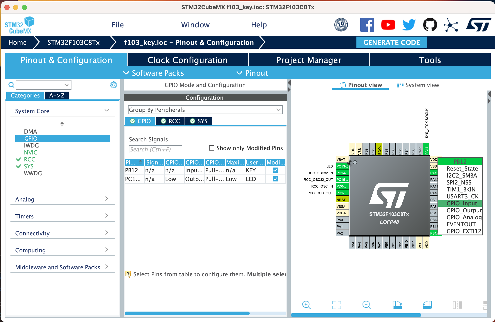
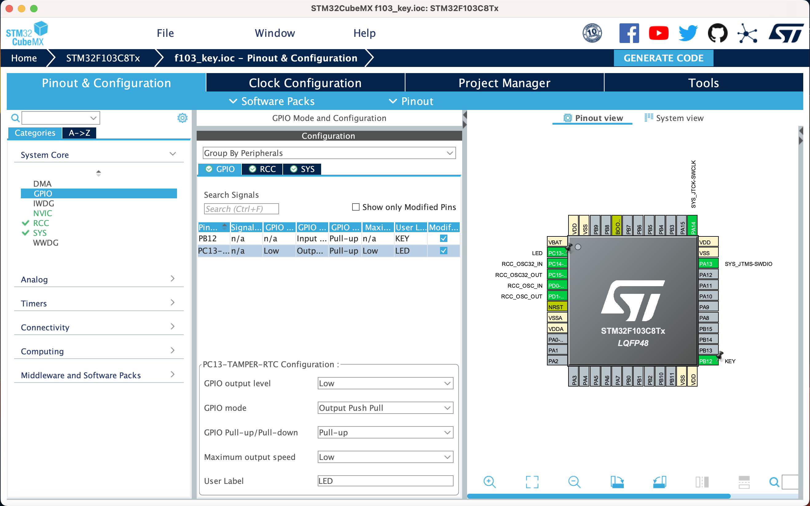

# Key Input

[English](README.md) | [中文](README_zh.md)

Input is one of the most important part of embedded system. In this part, we will learn how to read key input.

## 1. Configure STM32CubeMX

We assume that you have created a project, updated the clock configuration and added the LED pin into the project. If not, please refer to [1.3. LED](../3.LED/README.md).

We can see that the key is connected to the PB12 pin in the [Circuit diagram](../2.New_Empty_Project/attachments/SCH_Schematic1_2023-06-02.pdf). So we should set the PB12 pin as GPIO_Input mode.

Click the Pinout & Configuration tab, and then click the PB12 pin. In the Pinout view, select GPIO_Input in the Mode field.



Then click the GPIO tab, and then click the PB12 pin. In the GPIO view, select pull-up in the GPIO Pull-Up/Pull-Down field. This is because the pin is default connected to the VCC through a resistor. You can see the [Circuit diagram](../2.New_Empty_Project/attachments/SCH_Schematic1_2023-06-02.pdf) for details. If we use the pull-down mode, the key will always be pressed.

Also, there is a capacitor connected to the pin. This is used to debounce. You can see the [Circuit diagram](../2.New_Empty_Project/attachments/SCH_Schematic1_2023-06-02.pdf) for details. If you want to know more about the debounce, please refer to [Debounce](https://en.wikipedia.org/wiki/Debounce).

You can set the maxinum output speed to high speed, but it is not necessary.



Then generate the code.

## 2. Write the code

In the `Core/Src/main.c` file, we can see the `while(1)` loop. We can write the code in the loop.

```c
/* USER CODE BEGIN WHILE */
while (1)
{
    /* USER CODE END WHILE */

    /* USER CODE BEGIN 3 */
    if (HAL_GPIO_ReadPin(GPIOB, GPIO_PIN_12) == GPIO_PIN_RESET)
    {
        HAL_GPIO_WritePin(GPIOC, GPIO_PIN_13, GPIO_PIN_RESET);
    }
    else
    {
        HAL_GPIO_WritePin(GPIOC, GPIO_PIN_13, GPIO_PIN_SET);
    }
}
```

The `HAL_GPIO_ReadPin` function is used to read the pin state. The first parameter is the GPIO port, the second parameter is the GPIO pin. The return value is the GPIO pin state. The `GPIO_PIN_RESET` means the pin is low, and the `GPIO_PIN_SET` means the pin is high.

Then build and flash the project. You can see the LED is light when the key is pressed.
