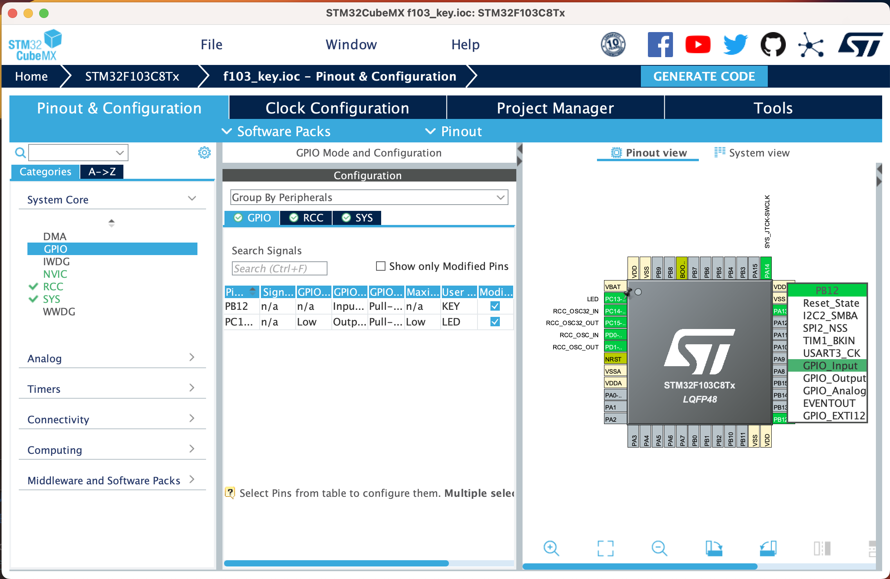
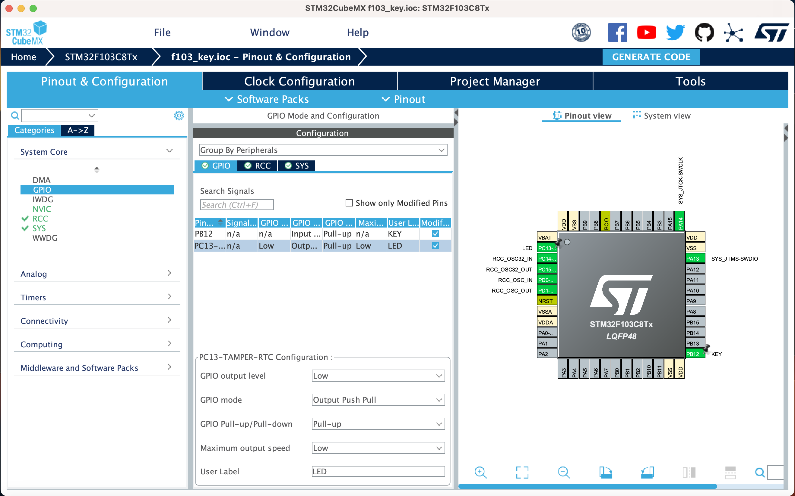

# 按钮输入

[English](README.md) | [中文](README_zh.md)

输入是嵌入式系统中最重要的部分之一。在这一部分，我们将学习如何读取按键输入。

## 1. 配置 STM32CubeMX

我们假设你已经新建了一个工程并且更新了时钟配置并且将 LED 引脚添加到了工程中。如果没有，请参考[1.3. LED](../3.LED/README_zh.md)。

我们可以在[电路图](../2.New_Empty_Project/attachments/SCH_Schematic1_2023-06-02.pdf)中看到按键连接到了 PB12 引脚。所以我们需要将 PB12 引脚设置为 GPIO_Input 模式。

点击 Pinout & Configuration 标签，然后点击 PB12 引脚。在 Pinout 视图中，将 Mode 字段设置为 GPIO_Input。



然后点击 GPIO 标签，然后点击 PB12 引脚。在 GPIO 视图中，将 GPIO Pull-Up/Pull-Down 字段设置为 pull-up。这是因为按键通过一个电阻连接到了 VCC。你可以在[电路图](../2.New_Empty_Project/attachments/SCH_Schematic1_2023-06-02.pdf)中看到细节。如果我们使用 pull-down 模式，按键将会一直被按下。

并且，按钮输入的PIN接入了一个电容。这是用来去除抖动的的。你可以在[电路图](../2.New_Empty_Project/attachments/SCH_Schematic1_2023-06-02.pdf)中看到细节。如果你想了解更多去抖的知识，请参考[按键消抖](https://baike.baidu.com/item/按键消抖/1566537)。

同时，你可以将输入速度设置为高速，但是这不是必须的。



然后点击 Generate Code 按钮生成代码。

## 2. 修改代码

在 `Core/Src/main.c` 文件中，我们可以看到 `while(1)` 循环。我们可以在循环中编写代码。

```c
/* USER CODE BEGIN WHILE */
while (1)
{
    /* USER CODE END WHILE */

    /* USER CODE BEGIN 3 */
    if (HAL_GPIO_ReadPin(GPIOB, GPIO_PIN_12) == GPIO_PIN_RESET)
    {
        HAL_GPIO_WritePin(GPIOC, GPIO_PIN_13, GPIO_PIN_RESET);
    }
    else
    {
        HAL_GPIO_WritePin(GPIOC, GPIO_PIN_13, GPIO_PIN_SET);
    }
}
```

函数 `HAL_GPIO_ReadPin` 用来读取引脚状态。第一个参数是 GPIO 端口，第二个参数是 GPIO 引脚。返回值是 GPIO 引脚状态。`GPIO_PIN_RESET` 表示引脚低电平，`GPIO_PIN_SET` 表示引脚高电平。

然后编译并下载工程。你可以看到 LED 会在按键按下时亮起。
