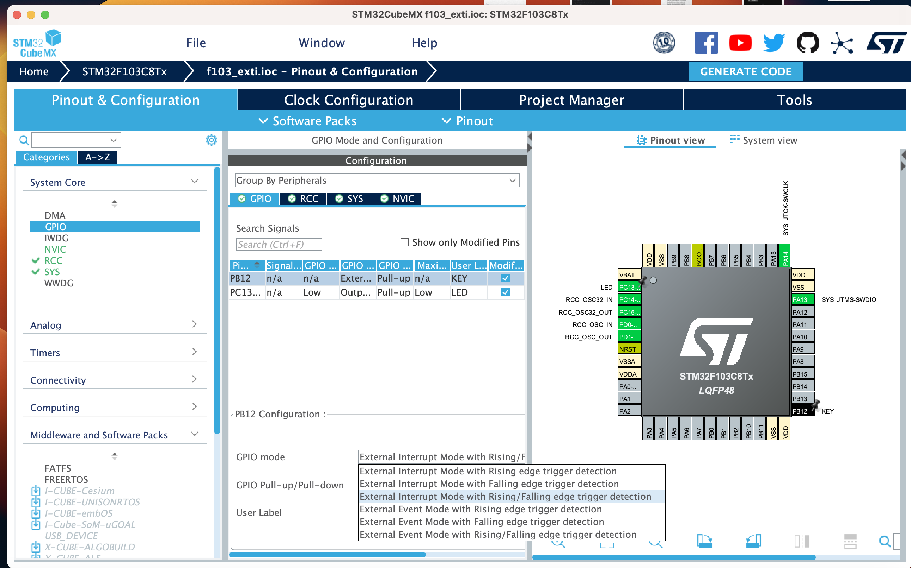

# Key Inturrupt

[English](README.md) | [中文](README_zh.md)

## What is inturrupt?

In embedded systems, we often need to respond to external events. For example, when a button is pressed, we need to turn on the LED. In this case, we need to constantly read the button state in the main loop. This is called polling. However, this method is not efficient. We can use inturrupt to solve this problem.

Inturrupt is a mechanism that allows the CPU to respond to external events in time. When an external event occurs, the CPU will stop the current task and execute the corresponding inturrupt service routine. After the inturrupt service routine is executed, the CPU will return to the original task.

So we can use inturrupt to respond to external events. For example, when a button is pressed, we can use inturrupt to turn on the LED.

However, the programs in the inturrupt service routine should be as simple as possible. This is because the CPU will stop the current task when an inturrupt occurs. If the inturrupt service routine is too long, the CPU will spend too much time on the inturrupt service routine, and the main task will not be executed in time. This will cause the system to crash.

## Priority of inturrupt

In the STM32F103C8T6, there are 16 inturrupts. The priority of inturrupts is from 0 to 15. The smaller the number, the higher the priority. The inturrupt with the highest priority is the reset inturrupt. The inturrupt with the lowest priority is the systick inturrupt.

The higher priority inturrupt can interrupt the lower priority inturrupt. For example, if the systick inturrupt is executing, and the key inturrupt occurs, the key inturrupt will interrupt the systick inturrupt.

## Fault Inturrupt

In addition to the normal inturrupt, there is also a fault inturrupt. The fault inturrupt is used to handle the fault. For example, when the stack overflow occurs, the fault inturrupt will be executed.
In General, When the fault inturrupt occurs, the system will stop forever (It has got an `while(1)` loop in the fault inturrupt service routine). So we should avoid the fault inturrupt, like the stack overflow and the memory access error.

## Setting up the inturrupt with STM32CubeMX

1. Open the STM32CubeMX, and select the STM32F103C8T6, Update the clock and debug configuration, and set up the LED to PC13.

2. Select the PB12 pin as the GPIO_EXTI12, to generate the inturrupt.

    

3. Change to the GPIO tab, click the PB12 pin, and select the External Interrupt Mode with Rising/Falling edge trigger detection.

    

4. Select the NVIC, and enable the EXTI line 10 to 15 interrupt, and set the priority.

    

5. Generate the code, and open the project with Clion.

## The code

Let's turn on the file `stm32f1xx_it.c`, and watch the code:

```c
void EXTI15_10_IRQHandler(void) {
    /* USER CODE BEGIN EXTI15_10_IRQn 0 */

    /* USER CODE END EXTI15_10_IRQn 0 */
    HAL_GPIO_EXTI_IRQHandler(GPIO_PIN_12);
    /* USER CODE BEGIN EXTI15_10_IRQn 1 */

    /* USER CODE END EXTI15_10_IRQn 1 */
}
```

The `HAL_GPIO_EXTI_IRQHandler` function is used to handle the inturrupt.

Let's check the `HAL_GPIO_EXTI_IRQHandler` function:

```c
void HAL_GPIO_EXTI_IRQHandler(uint16_t GPIO_Pin)
{
  /* EXTI line interrupt detected */
  if (__HAL_GPIO_EXTI_GET_IT(GPIO_Pin) != 0x00u)
  {
    __HAL_GPIO_EXTI_CLEAR_IT(GPIO_Pin);
    HAL_GPIO_EXTI_Callback(GPIO_Pin);
  }
}
```

First the function will check if the specified inturrupt has occurred. If the inturrupt has occurred, the function will clear the inturrupt flag, and call the `HAL_GPIO_EXTI_Callback` function.

Let's check the `HAL_GPIO_EXTI_Callback` function:

```c
__weak void HAL_GPIO_EXTI_Callback(uint16_t GPIO_Pin)
{
  /* Prevent unused argument(s) compilation warning */
  UNUSED(GPIO_Pin);

  /* NOTE: This function should not be modified, when the callback is needed,
           the HAL_GPIO_EXTI_Callback could be implemented in the user file
   */
}
```

The `HAL_GPIO_EXTI_Callback` function is a weak function. We can override this function in any file, and the new function will be called.

So we add the code in the `main.c`, before the `int main` function:

```c
void HAL_GPIO_EXTI_Callback(uint16_t GPIO_Pin) {
    if(GPIO_Pin == KEY_Pin && HAL_GPIO_ReadPin(KEY_GPIO_Port, KEY_Pin) == GPIO_PIN_RESET) {
        HAL_GPIO_TogglePin(LED_GPIO_Port, LED_Pin);
    }
}
```

## Compile and run

Compile and run the code, and press/unpress the button, the LED will toggle.

## Advanced Task

1. If change the GPIO mode to External Interrupt Mode with Failing edge trigger detection, what will happen?

2. If we press the button for a long time, the LED will toggle many times. How to solve this problem?

3. If we setup another button, and connect it to the PB13 pin, and set the different priority for the two buttons. Then we set when the PB12 button is pressed, the LED will light and only if the PB12 button is released, the LED will turn off. When the PB13 button is pressed, the LED will toggle each second. How to do this?
