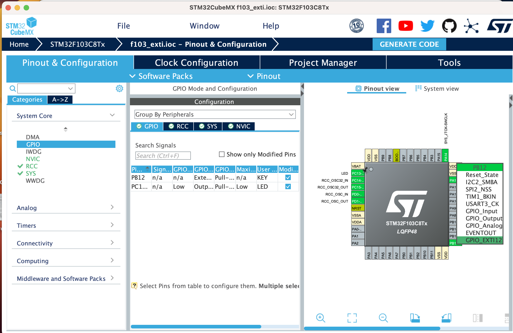
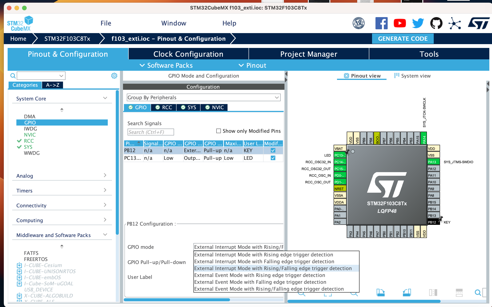
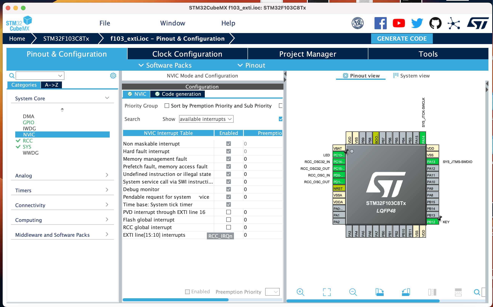

# 按键中断

[English](README.md) | [中文](README_zh.md)

## 什么是中断

在嵌入式系统中，我们经常需要响应外部事件。例如，当按下按钮时，我们需要点亮 LED。在这种情况下，我们需要在主循环中不断读取按钮状态。这被称为轮询。但是，这种方法并不高效。我们可以使用中断来解决这个问题。

中断是一种机制，它允许 CPU 及时响应外部事件。当发生外部事件时，CPU 将停止当前任务并执行相应的中断服务例程。执行中断服务例程后，CPU 将返回原始任务。

因此，我们可以使用中断来响应外部事件。例如，当按下按钮时，我们可以使用中断来点亮 LED。

但是，中断服务例程中的程序应尽可能简单。这是因为当发生中断时，CPU 将停止当前任务。如果中断服务例程太长，CPU 将花费太多时间在中断服务例程上，主任务将无法及时执行。这将导致系统崩溃。

## 中断的优先级

在 STM32F103C8T6 中，有 16 个中断。中断的优先级从 0 到 15。数字越小，优先级越高。优先级最高的中断是复位中断。优先级最低的中断是滴答中断（系统计时器）。
优先级较高的中断可以中断优先级较低的中断。例如，如果滴答中断正在执行，并且按键中断发生，则按键中断将中断滴答中断。

## 错误中断

除了正常的中断外，还有错误中断。错误中断用于处理错误。例如，当堆栈溢出时，将执行错误中断。通常情况下，当发生错误中断时，系统将永远停止（错误中断服务例程中有一个 `while(1)` 循环）。因此，我们应该避免错误中断，例如堆栈溢出和内存访问错误。

## 使用 STM32CubeMX 设置中断

1. 打开 STM32CubeMX，选择 STM32F103C8T6，更新时钟和调试配置，并将 LED 设置为 PC13。

2. 将 PB12 设置为 GPIO_EXTI12，以生成中断。

    

3. 切换到 GPIO 标签，单击 PB12 引脚，并将 GPIO Mode 设置为 External Interrupt Mode with Rising/Falling edge trigger detection。

    

4. 选择 NVIC，启用 EXTI line 10 to 15 interrupt，并设置优先级。

    

5. 生成代码，并使用 Clion 打开项目。

## 代码分析

打开 `stm32f1xx_it.c` 文件，查看代码：

```c
void EXTI15_10_IRQHandler(void) {
    /* USER CODE BEGIN EXTI15_10_IRQn 0 */

    /* USER CODE END EXTI15_10_IRQn 0 */
    HAL_GPIO_EXTI_IRQHandler(GPIO_PIN_12);
    /* USER CODE BEGIN EXTI15_10_IRQn 1 */

    /* USER CODE END EXTI15_10_IRQn 1 */
}
```

函数 `EXTI15_10_IRQHandler` 是中断服务的入口。

查看 `HAL_GPIO_EXTI_IRQHandler` 函数的定义：

```c
void HAL_GPIO_EXTI_IRQHandler(uint16_t GPIO_Pin)
{
  /* EXTI line interrupt detected */
  if (__HAL_GPIO_EXTI_GET_IT(GPIO_Pin) != 0x00u)
  {
    __HAL_GPIO_EXTI_CLEAR_IT(GPIO_Pin);
    HAL_GPIO_EXTI_Callback(GPIO_Pin);
  }
}
```

函数 `__HAL_GPIO_EXTI_GET_IT` 用于检查指定的中断是否发生。函数 `__HAL_GPIO_EXTI_CLEAR_IT` 用于清除中断标志。函数 `HAL_GPIO_EXTI_Callback` 用于调用回调函数。

查看 `HAL_GPIO_EXTI_Callback` 函数的定义：

```c
__weak void HAL_GPIO_EXTI_Callback(uint16_t GPIO_Pin)
{
  /* Prevent unused argument(s) compilation warning */
  UNUSED(GPIO_Pin);

  /* NOTE: This function should not be modified, when the callback is needed,
           the HAL_GPIO_EXTI_Callback could be implemented in the user file
   */
}
```

函数 `HAL_GPIO_EXTI_Callback` 是一个弱函数。我们可以在任何文件中重写此函数，新函数将被调用。

## 重写回调函数

我们需要在按键中断发生时改版 LED 的状态。因此，我们需要重写回调函数。我们可以在 `main.c` 文件中重写回调函数。

```c
void HAL_GPIO_EXTI_Callback(uint16_t GPIO_Pin) {
    if(GPIO_Pin == KEY_Pin && HAL_GPIO_ReadPin(KEY_GPIO_Port, KEY_Pin) == GPIO_PIN_RESET) {
        HAL_GPIO_TogglePin(LED_GPIO_Port, LED_Pin);
    }
}
```

## 编译和运行

编译和运行代码。当按下按钮时，LED 将点亮。

## 思考

1. 如果将 GPIO 模式设置为 External Interrupt Mode with Rising edge trigger detection，会发生什么？

2. 如果我们长时间按下按钮，LED 将多次切换。如何解决这个问题？

3. 如果我们设置另一个按钮，并将其连接到 PB13 引脚，并为两个按钮设置不同的优先级。然后我们设置当按下 PB12 按钮时，LED 将点亮，只有当 PB12 按钮释放时，LED 才会关闭。当按下 PB13 按钮时，LED 将每秒切换一次。如何做到这一点？
