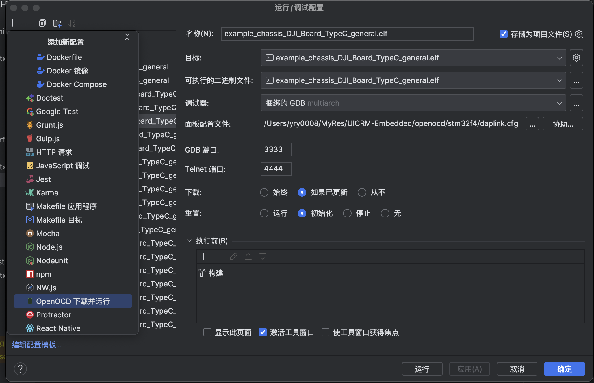
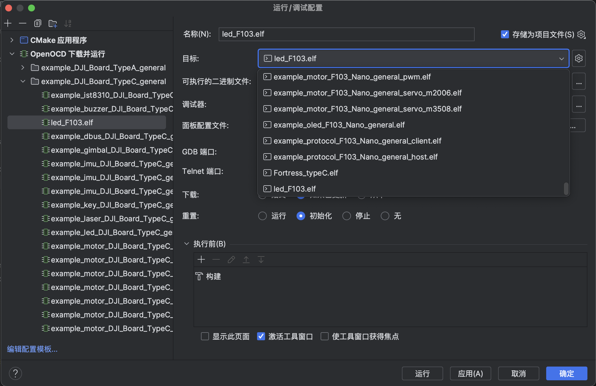
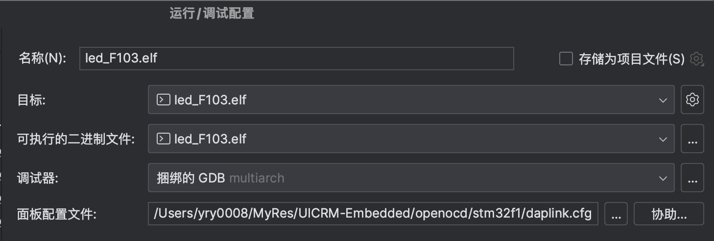

# 在新框架中新建代码

[English](README.md) | [中文](README_zh.md)

## 1. 框架文件结构

电控框架有以下几个文件夹用于存放我们的代码

| 文件夹名字 | 用途 | 
| -------- | -------- | 
| boards | 框架底层、协议、传感器适配 | 
| boards/base | 开发板底层 | 
| boards/platform | 开发板/平台I/O中间层 | 
| boards/third_party | 第三方library |
| boards/algorithm | 算法封装（PID等） |
| boards/drivers | 传感器/电机/其他执行器封装 |
| boards/components | 由多个组件组成的一组执行器，通常用于完成特定功能（例如麦克纳姆轮底盘） |
| cmake | cmake相关文件 |
| examples | 示例代码 |
| openocd | openocd相关文件，用于烧录程序 |
| programs | 项目代码 |

非底层适配小组一般只需要修改 `programs` 目录下的代码。

## 2. 新建程序

在 `programs` 目录下新建一个代表自己名字的文件夹，再在该文件夹内新建一个文件夹，例如 `programs/yry0008/program1`，并在每一层文件夹下新建 `CMakeLists.txt` 文件，内容分别如下：


**programs/CMakeLists.txt**

> 在原有文件末尾添加

```cmake
add_subdirectory(yry0008)
```

> 此处`yry0008`应该改为代表你自己名字的文件夹的名字
> `add_subdirectory` 的作用是添加一个子目录，这样在编译时，cmake会自动进入该目录下寻找 `CMakeLists.txt` 文件，从而编译该目录下的程序。


**programs/yry0008/CMakeLists.txt**

```cmake
add_subdirectory(program1)
```

> 此处`program1`应该改为你的程序的名字

**programs/yry0008/program1/CMakeLists.txt**

```cmake
# CMakeLists.txt
project(program1 ASM C CXX)


uicrm_add_arm_executable(${PROJECT_NAME}
        TARGET ${TARGET}
        SOURCES ${SOURCES}
        INCLUDES ${INCLUDES}
)
```

> 此处有几个变量， `${PROJECT_NAME}` 代表程序名， `${TARGET}` 代表编译目标，目前代表的是开发板底层包的名字，目前可以选择 `DJI_Board_TypeC_general`、`DJI_Board_TypeA_general`、`DM_MC01_general`、`F103_Nano_general`， `${SOURCES}` 代表源文件的集合， `${INCLUDES}` 代表头文件的目录位置。

举个例子（参照[RMUL2023](https://github.com/UIC-RoboMaster/UICRM-Embedded/blob/RMUL2023/programs/Fortress/CMakeLists.txt)分支下的Fortress程序）

```cmake
project(Fortress ASM C CXX)


uicrm_add_arm_executable(${PROJECT_NAME}_typeC
        TARGET DJI_Board_TypeC_general
        SOURCES
        src/main.cpp
        src/public_port.cpp
        src/imu_task.cpp
        src/gimbal_data.cpp
        src/gimbal_task.cpp
        src/shoot_task.cpp
        src/remote_task.cpp
        src/chassis_task.cpp
        src/referee_task.cpp
        src/ui_task.cpp
        src/selftest_task.cpp
        src/buzzer_task.cpp
        INCLUDES include)
```

> 其中，在此处使用相对目录的文件与目录时，以当前`CMakeLists.txt`文件所在目录为准。

现在的例子：
    
```cmake
# CMakeLists.txt
project(program1 ASM C CXX)


uicrm_add_arm_executable(${PROJECT_NAME}
        TARGET DJI_Board_TypeC_general
        SOURCES main.cpp
)
```

**注意⚠️：`INCLUDES`在没有自定义引用的情况下可以没有，但是`SOURCES`不能没有。**

## 3. 编写程序

按照上一步，我们应该新建对应的程序文件在对应的目录内新建对应的程序文件。
例如此处我们应该新建`main.cpp`
在文件写入以下代码：

```cpp
#pragma once
// 引入STM32基础头文件
#include "main.h"
// 引入RTOS头文件以获得时间与多线程支持
#include "cmsis_os2.h"

// RM_RTOS_Init() 函数会在 RTOS 启动前执行一次，可以在此处进行一些初始化操作。
// 注意：此函数在 RTOS 启动前运行，所以无法使用 osDelay() 进行延迟，此处应该使用 HAL_Delay()。
// 同时，一些需要 RTOS 支持的操作也无法在此处进行，例如使用队列、信号量等。但是可以在此处初始化这些 RTOS 对象。
void RM_RTOS_Init(void) {
    // HAL_Delay(3000);
}

// RM_RTOS_Mutexes_Init() 函数会在 RTOS 启动前执行一次，可以在此处初始化互斥锁。这个函数不是必需的，可以不写上。
void RM_RTOS_Mutexes_Init(void){

}

// RM_RTOS_Semaphores_Init() 函数会在 RTOS 启动前执行一次，可以在此处初始化信号量。这个函数不是必需的，可以不写上。
void RM_RTOS_Semaphores_Init(void){

}

// RM_RTOS_Timers_Init() 函数会在 RTOS 启动前执行一次，可以在此处初始化 RTOS 内的定时器。这个函数不是必需的，可以不写上。
void RM_RTOS_Timers_Init(void){

}

// RM_RTOS_Queues_Init() 函数会在 RTOS 启动前执行一次，可以在此处初始化队列。这个函数不是必需的，可以不写上。
void RM_RTOS_Queues_Init(void){

}

// RM_RTOS_Threads_Init() 函数会在 RTOS 启动前执行一次，可以在此处初始化线程。这个函数不是必需的，可以不写上。
// 一般情况下，我们会在这里创建每个子任务的线程，用于执行具有多任务的程序。
void RM_RTOS_Threads_Init(void){

}

// RM_RTOS_Ready() 函数会在 RTOS 的各对象准备就绪后执行一次，可以在此处进行一些初始化操作。
void RM_RTOS_Ready(void){

}


// RM_RTOS_Default_Task() 函数是一个默认的线程，框架内的 RTOS 必定会执行这个线程。
// 注意：此函数在 RTOS 启动后运行，所以无法使用 HAL_Delay() 进行延迟，HAL_Delay()会阻塞整块开发板的进行，此处应该使用 osDelay()。
// 如果没有特殊情况需要结束这个线程，那么这个函数应该需要一个死循环让程序不会结束。这与我们在 computer science 课程内的各种作业不同。
void RM_RTOS_Default_Task(const void* args) {
    UNUSED(args);
    while (true) {
        osDelay(1000);
    }
}
```

## 4. 添加各种 modules 进入程序框架。

在每个 C++ 文件开头可以引入各种库文件，里面有各种class可以实现各种功能。

#### Platform 层
| 库文件名字 | 用途 | 相关的 class |
|-----------|-------|---------|
|  bsp_gpio.h   |   GPIO 与 GPIO 中断控制   |   `bsp::GPIO`、`bsp::GPIT` |
|  bsp_adc.h   |   ADC 的读取   | `bsp::bADC` |
|  bsp_can.h   |   CAN 的接收与发送   | `bsp::CAN` |
|  bsp_uart.h   |   UART 的接收与发送   | `bsp::UART` |
|  bsp_i2c.h   |   I2C 的接收与发送   | `bsp::I2C` |
|  bsp_spi.h   |   SPI 的接收与发送(TODO)   | `bsp::SPI` |
|  bsp_pwm.h   |   PWM 的输出   | `bsp::PWM` |
|  bsp_error_handler.h   |   错误处理   | `bsp_error_handler()`(Function) |
|  bsp_os.h   |   RTOS 的时钟接口   | `bsp::SetHighresClockTimer()`(Function)、`bsp::GetHighresTickMicroSec()`(Function)|
|  bsp_print.h   |   串口打印与`print`函数(类似于printf)   |
|  bsp_usb.h   |   USB 虚拟串口的接收与发送   | `bsp::VirtualUSB` |


#### Algorithm 层

| 库文件名字 | 用途 | 相关的 class |
|-----------|-------|------|
|  crc8.h   |   系统内通用通讯的 CRC8 校验   |  |
|  pid.h   |   PID 控制器   | `control::ConstrainedPID`、`control::PIDController` |
|  MahonyAHRS.h |  MahonyAHRS 算法   |  |
|  power_limit.h | 功率限制算法 |`control::PowerLimit`|
|  utils.h | 其他计算工具函数 | `EdgeDetector`|
|  arm_math.h | ARM DSP 库 |   |

#### Drivers 层

| 库文件名字 | 用途 |
|-----------|-------|
|  buzzer.h | 蜂鸣器控制 |
|  motor.h | 电机控制 |
|  dbus.h | 遥控器信号接收 |
|  dbus_package.h | 遥控器信号包 |
|  oled.h | OLED 显示屏控制 |
|  oled_fonts/各文件 | OLED 字体库与预置图片库 |
|  protocol.h (计划改名为 rm_referee_protocol.h) | 裁判系统收发 |
|  rgb.h | PWM 实现的 RGB 灯控制 |
|  spi_flash.h | SPI Flash 控制(TODO) |

#### Components 层

| 库文件名字 | 用途 |
|-----------|-------|
|  chassis.h (计划改名 mecanum_chassis.h) | 麦轮底盘控制 |
|  gimbal.h | 云台控制 |
|  shooter.h | 发射机构控制(TODO) |
|  user_interface.h (计划改名 rm_referee_user_interface.h) | 裁判系统UI |

大家可以探索每个 Library 的功能，以及如何使用。

## 5. 编译与下载程序

在 Clion 左下角更新 CMake 的数据，选择当前的project名字的配置进行编译

在选择配置出点击`编辑配置`，添加一组 `OpenOCD 下载并运行` 的配置，如下图所示：



将目标和二进制文件改成你的项目名字，例如 `yry0008_program1`。



将面板配置文件改成框架目录下的 `openocd/stm32f4/daplink.cfg`，点击 `确定` 保存配置。

注意⚠️：面板配置文件取决于开发板型号，不同不同开发板的文件可能不一样。例如`F103_Nano_general`需要使用`openocd/stm32f1/daplink.cfg`。



点击 `运行`(三角形图标) 烧录程序，然后就可以看到程序正在运行。
 
